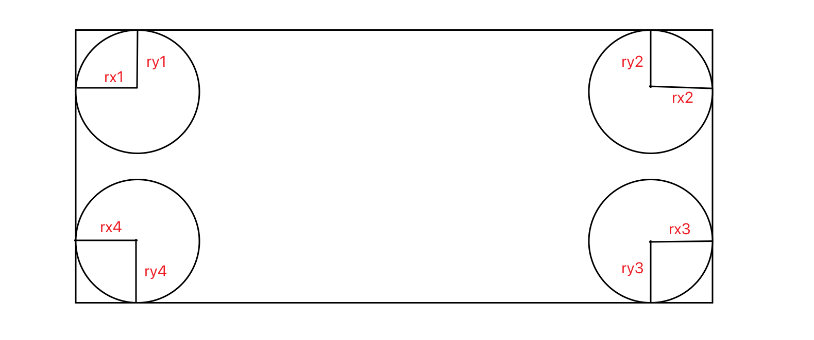

# border-radius

> `border-radius`是以下具体属性的简写属性：
>
> - `border-top-left-radius`：左上角，水平、垂直方向上的半径。
> - `border-top-right-radius`：右上角，水平、垂直方向上的半径。
> - `border-bottom-right-radius`：右下角，水平、垂直方向上的半径。
> - `border-bottom-left-radius`：左下角，水平、垂直方向上的半径。
>
> **注意**：**百分比(%)**相对于整个盒子的宽度或高度。

1. `border-radius: x1 x2 x3 x4 / y1 y2 y3 y4;`
2. `border-radius: x1 x2 x3 x4;`
3. `border-radius: v1 v2 v3; `
4. `border-radius: v1 v2;`
5. `border-radius: v1;`
6. `border-top-left-radius: x1 y1;`
7. `border-top-left-radius: v1;`

