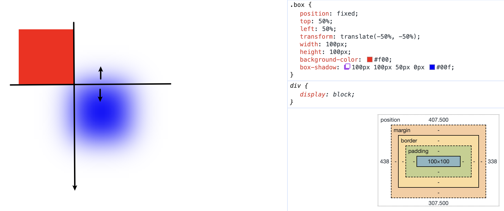
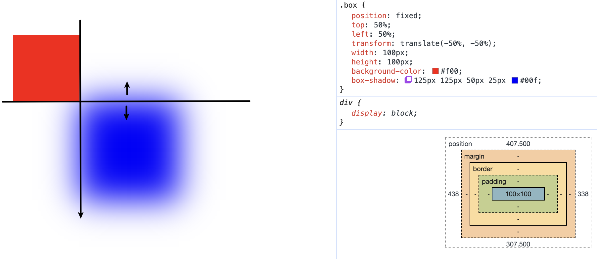
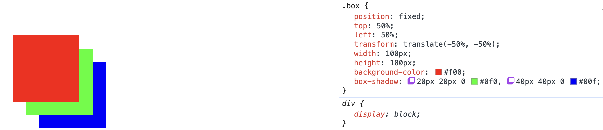

# box-shadow

> `box-shadow: type xOffset yOffset blur spread color;`
>
> - `type`：可选，阴影类型。省略，则为外阴影。值为`inset`时，表示内阴影。
>
> - `xOffset`：必需，水平阴影偏移量，可为负值。
> - `yOffset`：必需，垂直阴影偏移量，可为负值。
> - `blur`：可选，**向边界两侧模糊的模糊值**，值越大，越模糊，不可为负值。
> - `spread`：可选，向四周伸缩值，可为负值。
> - `color`：可选，阴影颜色。
>
> **注意**：
>
> - `box-shadow`支持多阴影，书写在前在z轴距离我们越近。（前面的会覆盖后面的）
> - 相同的阴影重复会加深。
> - 层次关系：盒子内容 => 阴影、边框 => 背景图 => 背景颜色。
> - **在黑环境下添加其他阴影颜色，先打一个白色阴影的底子。**

案例：[demo1](./assets/source/boxShadow/demo1.html)

<iframe src="./assets/source/boxShadow/demo1.html" height="400"></iframe>

## 外阴影

### 阴影模糊

> **阴影模糊**：在阴影边界位置向内、向外同时模糊相同的模糊值。

1. `spread为0`情况下模糊

   

2. `spread不为0`情况下模糊

   

## 多阴影在z轴层次

> **z轴层次**：先书写的阴影在前，越靠近屏幕方向。

