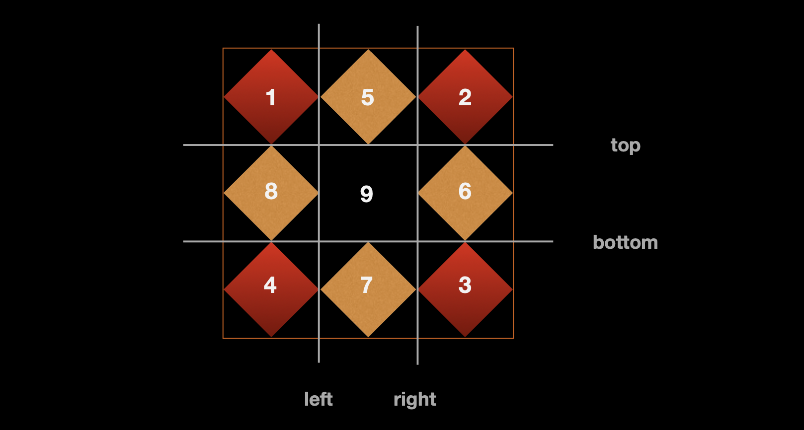

# border-image

> `border-image`是以下具体属性的简写属性：
>
> - `border-image-source`：`none | url(图片地址) |渐变`。
> - `border-image-width`：默认值为1，相对于`border-width`，设置边框图片显示的宽度。
> - `border-image-slice`: 默认值为100%，可以填写1~5个值。
> - `border-image-outset`：边框图片向外偏移值，不可为负值。
> - `border-image-repeat`：边框图片的重复方式，默认值为`stretch`，可以填写1~2个值。
>

案例：[demo1](./assets/source/borderImage/demo1.html)

<iframe src="./assets/source/borderImage/demo1.html"></iframe>

## border-image-slice

> `border-image-slice: top right bottom left`
>
> - `top`：距离图片顶边的距离，**直接书写数值或百分比**。
> - `right`：距离图片右边的距离，直接书写数值或百分比。
> - `bottom`：距离图片底边的距离，直接书写数值或百分比。
> - `left`：距离图片左边的距离，直接书写数值或百分比。
>
> **一个值**：`border-image-slice: v;`
>
> **两个值**：`border-image-slice: v1 v2;`
>
> **三个值**：`border-image-slice: v1 v2 v3;`
>
> **四个值**：`border-image-slice: v1 v2 v3 v4;`
>
> **五个值**：`border-image-slice: v1 v2 v3 v4 fill;`，盒子填充区域内也填充边框图片。

## border-image-width

> `border-image-width`默认值为1，等于`border-width`。
>
> - **填写数值**：表示`border-width`的倍数。

## border-image-repeat

> `border-image-repeat`默认值为`stretch`，表示水平或垂直方向上拉伸。
>
> **一个值**：`border-image-repeat: v1;`
>
> **两个值**：`border-image-repeat: v1 v2;`
>
> **水平或垂直方向上属性值**：`stretch`、`repeat`、`round`、`space`。

