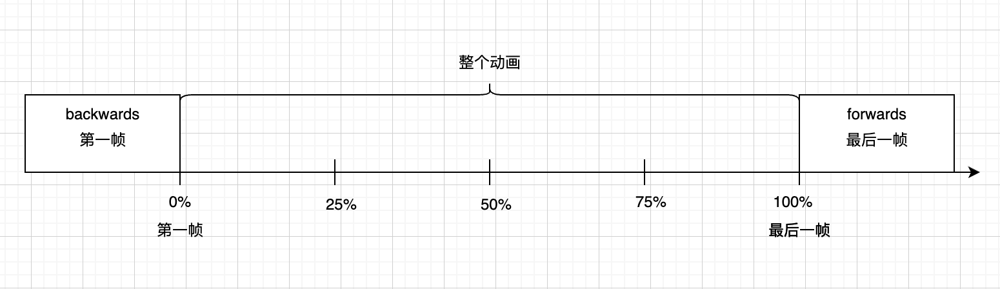

# animation-fill-mode

> 设置盒子在动画开始时，结束时状态。属性值有：`none`、`forwards`、`backwards`、`both`。
>
> - `none`：默认值，未设置盒子开始时状态和结束状态。
> - `forwards`：将动画最后一帧设置为盒子动画结束时状态。
> - `backwards`：将动画第一帧设置为盒子动画开始时状态。
> - `bath`：设置盒子动画开始时和结束时的状态。

