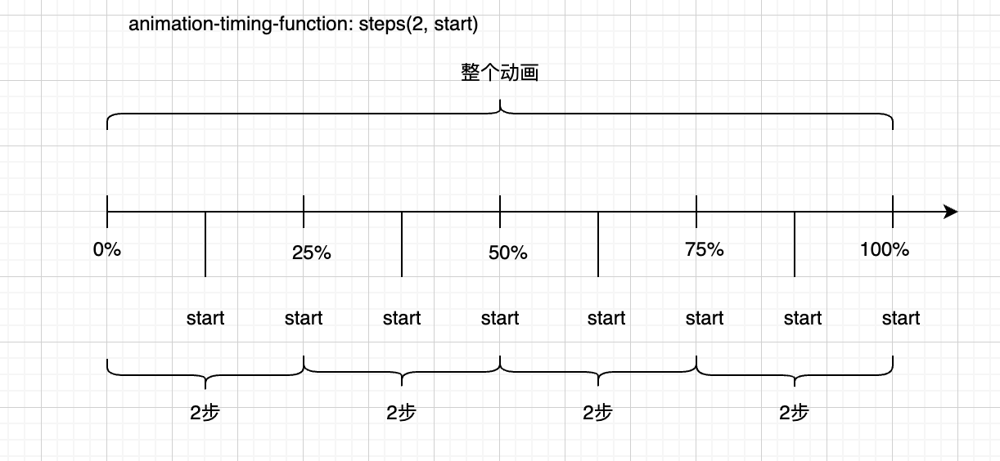
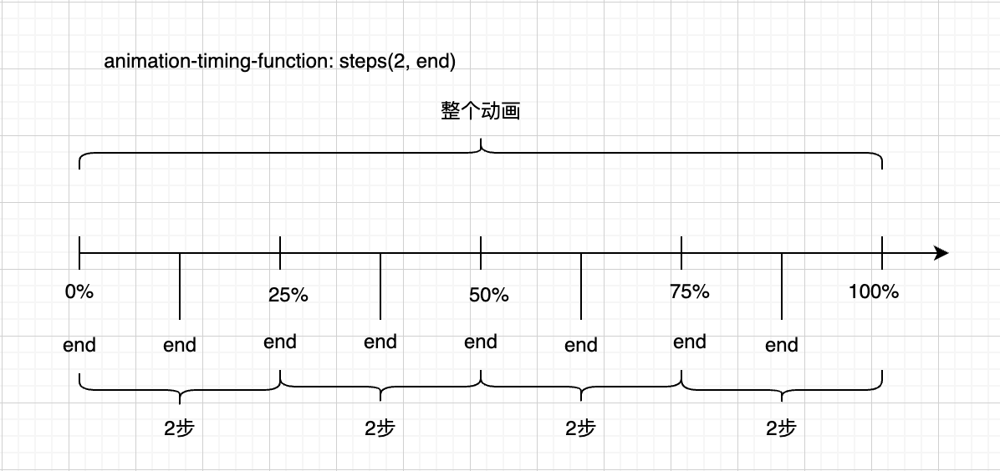

# 逐帧动画

> `animation-timing-function: steps(每段动画步数, 显示每逐帧起始状态还是结束状态)`
>
> - `每段动画步数`：将每段动画分为几逐帧完成。从1开始的正整数值。
> - `显示每逐帧起始状态还是结束状态`：
>   - `end`：保留当前逐帧状态，直到这段逐帧动画结束为止。视觉上，**丢失最后一帧**。
>   - `start`：保留当前逐帧动画结束状态。视觉上，**丢失第一帧**。

**逐帧动画**：等待一定时间，由一个状态**直接**变为另一个状态。

## start

>`animation-timing-function: steps(n, start);`
>
>- 丢失第一帧，无法使用`backwards`弥补第一帧。

案例：[demo1](./assets/source/steps/demo1.html)

<iframe src="./assets/source/steps/demo1.html"></iframe>

## end（常用）

> 丢失最后一帧，可以使用`forwards`弥补最后一帧。

案例：[demo2](./assets/source/steps/demo2.html)

<iframe src="./assets/source/steps/demo2.html"></iframe>

## 应用

### 打字效果

> `animation`支持多动画，同时运行。

<iframe src="./assets/source/steps/demo3.html"></iframe>

### 钟表效果

<iframe src="./assets/source/steps/demo4.html" height="300"></iframe>

### 跑马效果

<iframe src="./assets/source/steps/demo5.html"></iframe>

