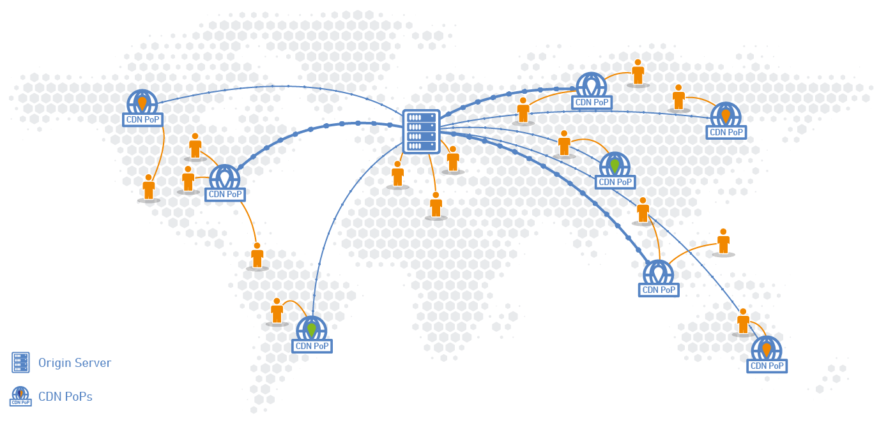
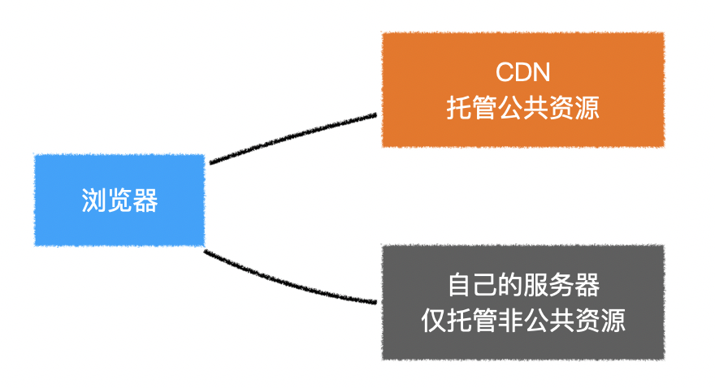

# 打包优化

## 分析打包结果

> 使用`webpack`搭建的工程，仅需加入一个`webpack`插件`webpack-bundle-analyzer`即可分析打包结果。
>
> `webpack`配置：

```js
const BundleAnalyzerPlugin = require('webpack-bundle-analyzer').BundleAnalyzerPlugin;

module.exports = {
	configureWebpack: config => {
        if (process.env.NODE_ENV === 'production') {
            // 为生产环境修改配置...
            return {
                plugins: [new BundleAnalyzerPlugin()]
            }
        } else {
            // 为开发环境修改配置...
        }
    }  
};
```


## 优化公共库打包体积

### 使用CDN

> **CDN**全称为**Content Delivery NetWork**，称之为内容分发网络。
>
> 它的基本原理是：架设多台服务器，这些服务器定期从源站拿取资源保存到本地，让不同地域的用户能够通过访问最近的服务器获得资源。



可以将项目中所有静态资源都放到CDN上（收费），也可以利用现成免费的CDN获取公共库的资源（存在安全隐患）。



1. 需要告诉`webpack`不要对那些公共库进行打包。

   ```js
   module.exports = {
   	configureWebpack: config => {
           if (process.env.NODE_ENV === 'production') {
               // 为生产环境修改配置...
               return {
                   externals: {
         				vue: "Vue",
         				vuex: "Vuex",
         				"vue-router": "VueRouter",
                       // 包名: 暴露的全局变量名
       			}
               }
           } else {
               // 为开发环境修改配置...
           }
       }  
   };
   ```

   

2. 在页面中手动加入`cdn`链接。（使用`esj模版代码`，仅在生产环境下注入`cdn`）

   ```html
   <body>
   	<div id="app"></div>
   	<% if (process.env.NODE_ENV === 'production') { %>
   		<script src="https://cdn.bootcdn.net/ajax/libs/vue/2.7.9/vue.min.js"></script>
   		<script src="https://cdn.bootcdn.net/ajax/libs/vuex/3.6.2/vuex.min.js"></script>
   		<script src="https://cdn.bootcdn.net/ajax/libs/vue-router/3.6.5/vue-router.min.js"></script>
           <script src="https://cdn.bootcdn.net/ajax/libs/axios/1.5.0/axios.min.js"></script>
   	<% } %>
   </body>
   ```

   

3. 使用以上方式导入`Vue`，`vuex`和`vue-router`会自动成为`Vue`插件，不再需要`Vue.use()`。

   `vue、vuex、vue-router`分别暴露`Vue、Vuex、VueRouter`全局变量。

   ```js
   if(!window.Vuex){
     	// 没有使用传统的方式引入Vuex
     	Vue.use(Vuex);
   }
   
   if(!window.VueRouter){
     	// 没有使用传统的方式引入VueRouter
     	Vue.use(VueRouter);
   }
   ```

   > 
   >
   > 构建工具在开发环境，会注入以下代码：
   >
   > ```js
   > const process = {
   >     env: {
   >         NODE_ENV: 'development'
   >     }
   > }
   > ```


## 启用现代模式

为了兼容各种浏览器，`vue-cli`在内部使用了`@babel/present-env`对代码进行降级，你可以通过`.browserlistrc`配置来设置需要兼容的目标浏览器。

这是一种比较偷懒的办法，因为对于那些使用现代浏览器的用户，它们也被迫使用了降级之后的代码，而降级的代码中包含了大量的`polyfill`，从而提升了包的体积。

因此，我们希望提供两种打包的结果：

1. 降级后的包（大），提供给旧浏览器用户使用。
2. 未降级的包（小），提供给现代浏览器用户使用。

除了应用`webpack`进行多次打包外，还可以利用`vue-cli`给我们提供的命令：

```shell
vue-cli-service build --modern
```


## 优化项目包体积

> 这里的项目包是指`src`目录中的打包结果：

### 页面分包

默认情况下，`webpack`将`src`目录中的所有代码打包成一个`bundle`。

这样就导致访问一个页面时，需要加载所有的`js`代码。

可以利用`webpack`对动态`import`的支持，从而达到把不同页面的代码打包到不同文件中：

```js
// 路由懒加载，routes配置
export default [
    {
        name: "home",
        path: "/",
        component: () => import("@/views/Home"),
    },
    {
        name: "about",
        path: "/about",
        component: () => import("@/views/About"),
    }
];
```


### 优化首屏响应

> 首页白屏，受很多因素的影响。

`vue`页面需要通过`js`构建。因此在`js`下载到本地之前，页面上什么也没有，会导致页面白屏。

一个非常简单有效的办法，即在页面中先渲染一个小的加载中效果，等到`js`下载到本地并运行后，即会自动替换。

```js
<div id="app">
    // 加载中效果，js加载并运行后，会替换
</div>
```


