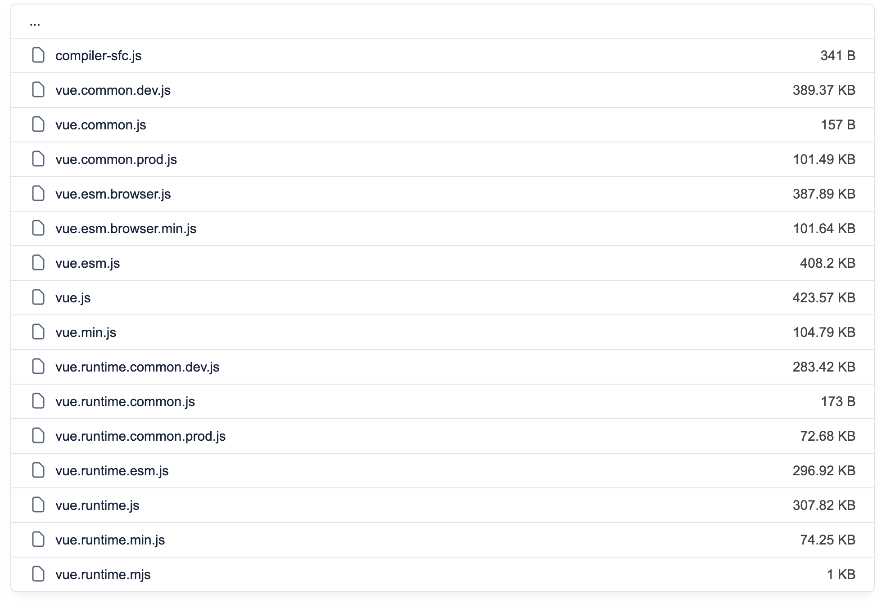
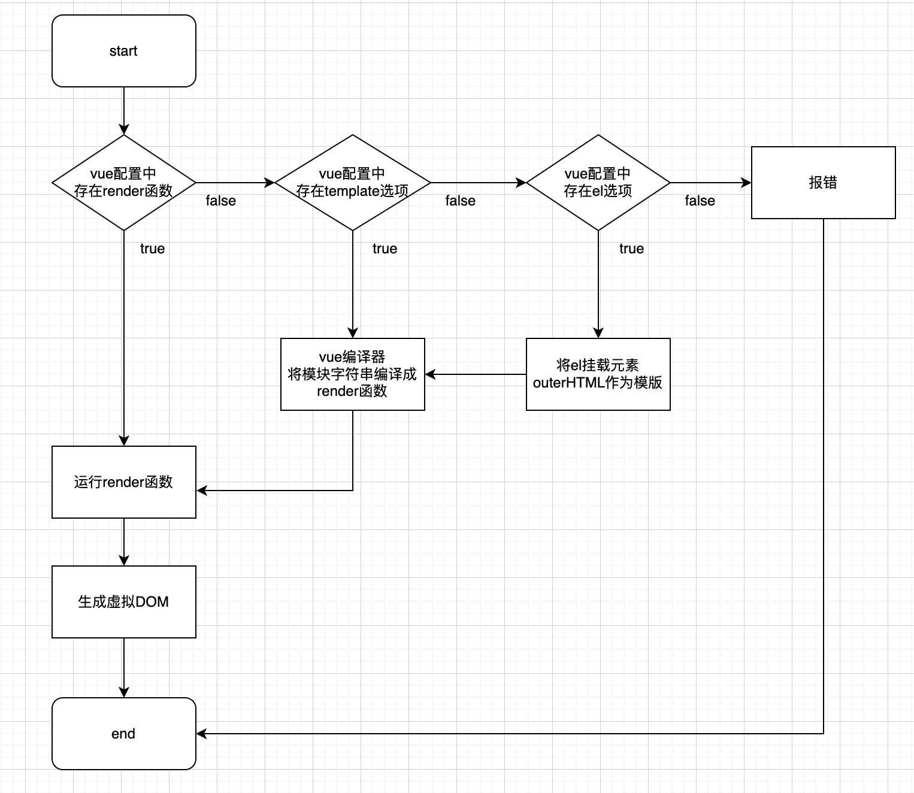

## [对不同构建版本的解释](https://v2.cn.vuejs.org/v2/guide/installation.html#%E5%AF%B9%E4%B8%8D%E5%90%8C%E6%9E%84%E5%BB%BA%E7%89%88%E6%9C%AC%E7%9A%84%E8%A7%A3%E9%87%8A)

> 在[NPM包的`dist/`目录](https://cdn.jsdelivr.net/npm/vue@2.7.14/dist/)，将会找到很多不同的Vue.js构建版本。




## [运行时 + 编译器 vs. 只包含运行时](https://v2.cn.vuejs.org/v2/guide/installation.html#运行时-编译器-vs-只包含运行时)

> vue由两部分组成：编译器+运行时。
>
> - 编译器：将模版字符串编译成Javascript渲染函数(`render`)的代码。
> - 运行时：用于创建Vue实例、数据响应式、渲染和处理虚拟DOM等代码。（除编译器外的代码）

```js
# 需要编译器：(传入一个字符串到template选项，或使用el选项挂载到一个元素上并以DOM的outerHTML作为模版)
new Vue({
    template: '<div>{{ hi }}</div>'
});

// 或
new Vue({
    el: '#app'
});

# 不需要编译器
new Vue({
    render: (h) => h('div', this.hi);
});
```


> 通过构建工具打包的vue项目中，在打包时，会使用vue的编译器，将模版字符串编译成Javascript渲染函数`render`。因此在打包的最终结果中，不包含编译器代码，仅包含运行时代码以及编译好的`render`函数。
>
> 
>
> 若是仍希望在打包结果中包含编译器代码，[参考（不推荐）](https://v2.cn.vuejs.org/v2/guide/installation.html#%E8%BF%90%E8%A1%8C%E6%97%B6-%E7%BC%96%E8%AF%91%E5%99%A8-vs-%E5%8F%AA%E5%8C%85%E5%90%AB%E8%BF%90%E8%A1%8C%E6%97%B6)。




## [开发环境 vs. 生产环境模式](https://v2.cn.vuejs.org/v2/guide/installation.html#开发环境-vs-生产环境模式)

```js
if(process.env.NODE_ENV === 'production'){
    // 生产环境
    
} else {
    // 开发环境
    
}
```


