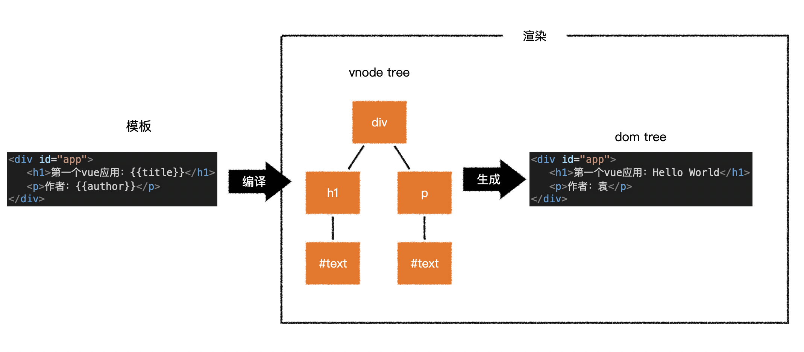
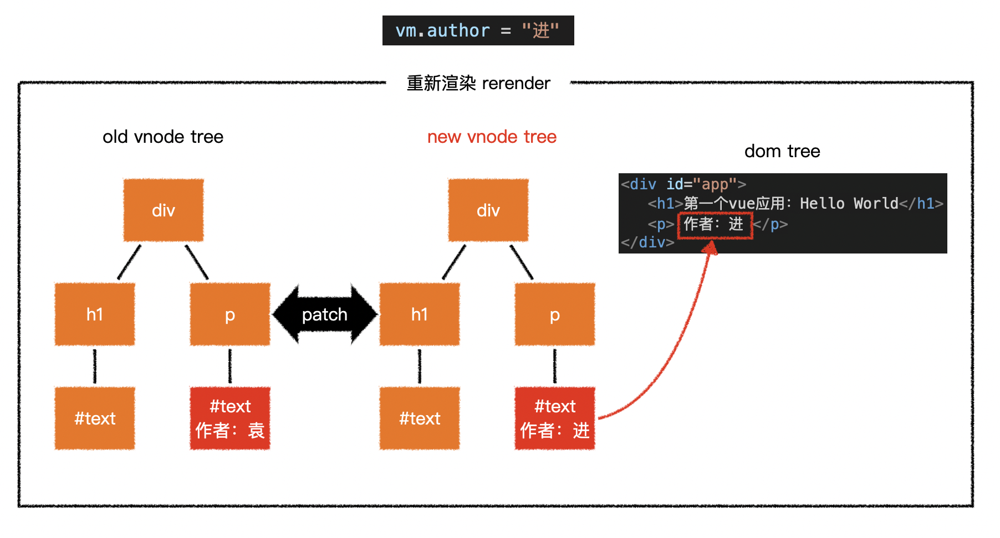

# 核心概念

**案例**：[demo2](./assets/source/demo2/index.html)

## Vue配置注入

```js
new Vue({
    el: '#app',
    data: {},
    computed: {},
    methods: {},
    // ...
})
```

**Vue配置对象**，会在Vue实例创建后注入到Vue实例中，作为Vue实例的成员。例如：

- `data`：与界面相关的数据。
- `computed`：通过现有数据计算得到的新数据。
- `methods`：定义可能会使用的方法。
- ...

**模板中能直接使用Vue实例成员。**


**Vue实例成员分为三类**：

1. Vue实例自身提供的实用属性和方法，**以$开头命名**。
2. 由配置对象注入的属性和方法。
3. Vue内部使用的属性和方法，**以_开头命名**。


## 虚拟DOM树（vnode）

> 直接操作真实的DOM会引发严重的效率问题，vue使用虚拟DOM（vnode）的方式来描述要渲染到页面的内容。
>
> vnode是一个普通的JS对象，用于描述要渲染到页面的内容。比如：
>
> ```js
> const vnode = {
>   	tag: 'h1',
>     children: [
>         {tag: undefined, text: '商品管理系统'}
>     ]
> };
> 
> // 有一个标签名为h1的节点，它有一个子节点，该子节点是一个文本，内容为“商品管理系统”。
> ```
>
> **vue模版并不是真实的DOM，它会被编译为虚拟DOM。**
>
> ```html
> <div id="app">
>     <h1>第一个vue应用：{{title}}</h1>
>     <p>作者：{{author}}</p>
> </div>
> ```
>
> 上面的模板会被编译为类似下面结构的虚拟DOM：
>
> ```js
> {
>     tag: 'div',
>     children: [
>         { tag: 'h1', children: [ { tag: undefined, text: "第一个vue应用：Hello World" } ]},
>         { tag: 'p', children: [{ tag: undefined, text: "作者： 袁" }]}
>     ]
> }
> ```
>
> **虚拟DOM树最终会生成为真实的DOM树。**
>
> 
>
> **Vue渲染**指的是：Vue根据模板编译生成虚拟DOM树，再根据虚拟DOM树，生成真实DOM树。
>
> **当（响应式）数据发生变化后，会引发重新渲染**。Vue会生成新的虚拟DOM树，比较新旧两颗虚拟DOM树，找出差异，将差异应用到真实DOM树中。
>
> 
>
> **在Vue中，要想得到最终的界面，必须得生成一个vnode tree。**
>
> Vue通过以下逻辑生成vnode tree：


1. 查找Vue配置中是否存在`render`方法。若是存在`render`方法，则运行`render`方法，将返回结果作为虚拟DOM树。
2. 若是不存在`render`方法，则继续查找Vue配置中是否存在`template`配置。若是存在`template`配置，则使用Vue模板编译器将`template`配置，编译成`render`方法。
3. 若是不存在`template`配置，则继续查找Vue配置中是否存在`el`配置。若是存在`el`配置，则将`el`配置指向元素的`outerHTML`作为模版。


**注意**：虚拟DOM树必须是单根的。（模板只能存在一个根元素）


## 挂载

> **将生成的真实DOM树，放置到某个元素位置**，称之为“**挂载**”。
>
> 挂载的方式：
>
> - **自动挂载**：`el: "css选择器"`进行配置。
> - **手动挂载**：`vue实例.$mount("css选择器")`进行配置。


##  完整流程


用户界面首次渲染，生成虚拟DOM，会增加首次渲染的时间。生成的虚拟DOM利在于，后续与用户界面的交互，比较新旧两颗虚拟DOM树，找出差异，将差异应用到真实DOM树。最大限度的避免频繁操作真实DOM，引发效率问题。


