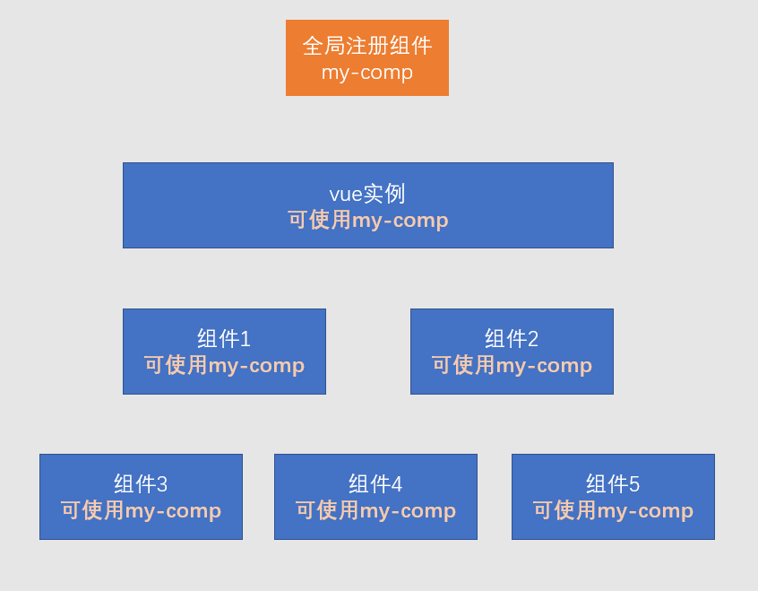
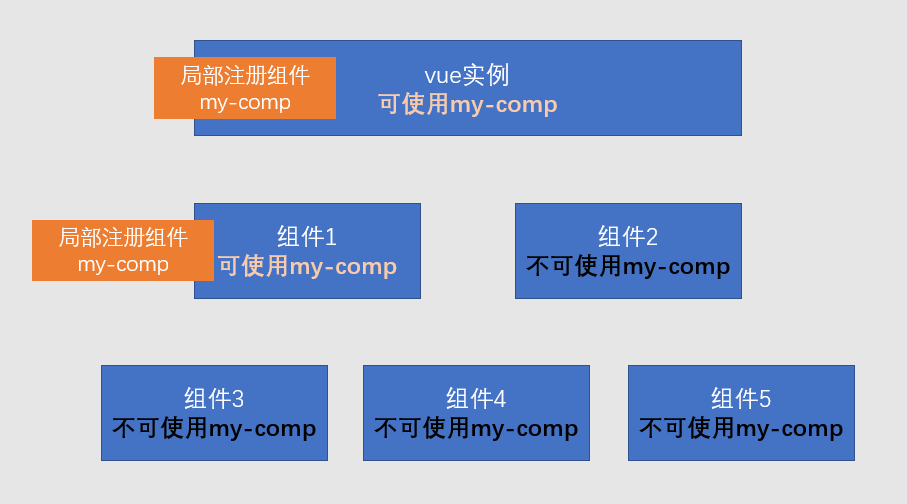
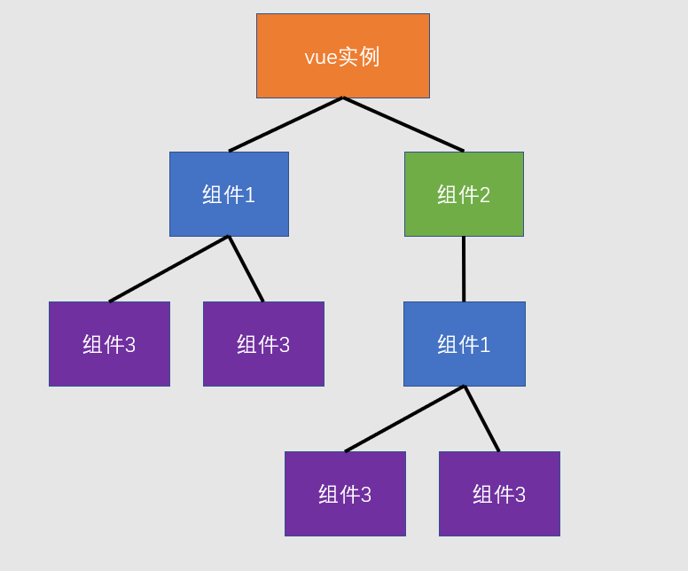
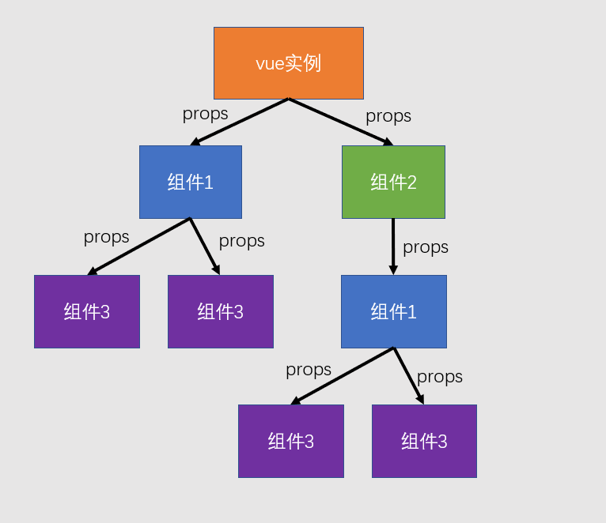

# 组件

> **组件的出现是为了实现以下两个目标**：
>
> 1. **降低整体复杂度**，提升代码的**可读性**和**可维护性**。（更加细粒度的拆分功能、结构）
> 2. **提升局部代码的可复用性**。
>
> **绝大部分情况下，一个组件就是页面中某个区域**，组件包含该区域的：
>
> - **内容**（模版代码）
> - **样式**（CSS代码）
> - **功能**（JS代码）
>
> 


## 组件开发

> Vue**组件是根据一个普通的配置对象创建的。**
>
> 所以要开发一个Vue组件，只需要编写一个Vue组件配置对象即可。

Vue组件配置和Vue配置几乎一样，不同在于：

- 没有`el`配置。
- `data`必须是一个方法，且该方法返回的对象作为Vue组件的（响应式）数据。
- 由于没有`el`配置，组件的虚拟DOM树必须定义在`template`或`render`中。


### 创建组件

案例：[demo3](./assets/source/demo3/index.html)

> **创建组件**，即是编写一个组件配置对象。（组件是根据配置对象创建的）
>
> 一个组件一般包含：模版(内容)+功能(JS)+样式(CSS)。

```js
const MyComp = {
    data(){ 
        return { 
            // 数据
        };
    },
    template: `...` // 模版
};
```


### 注册组件

> **组件创建后，要使用，必须注册**。注册组件分为：
>
> - **全局注册**：整个应用都能使用。
> - **局部注册**：仅限于注册的组件内能使用。

#### 全局注册



```js
Vue.component('MyComp', MyComp);
// 参数1：组件名称，在模板中使用组件时，会使用该名称
// 参数2: 组件配置对象
// 运行该代码后，可在模板中使用该组件。
```

> **注意**：**仅限全局使用的组件，进行全局注册**。否则在工程化项目中，构建工具无法优化打包，导致打包体积增加。


#### 局部注册

> **局部注册**：哪里要用到该组件，就在哪里注册。



**在要使用的组件中注册**：

```js
const OtherComp = {
    components: {
        // 属性名为组件名称，在模版中使用该名称
        // 属性值为组件配置对象
        MyComp
    },
    template: `
   		<div>
   			<!-- 该组件的其他内容 -->
   			<MyComp />
   		</div>
    `
};
```

**在要使用的Vue实例中注册或直接使用**：

```js
new Vue({
    render: h => h(MyComp)
});

// 等价于

new Vue({
    components: {
        MyComp
    },
    template: `<MyComp />`
});
```


### 应用组件

> **在模版中使用组件，将组件名作为HTML元素名使用即可。**
>
> 但要注意以下几点：

1. **组件必须有结束**

   组件可以自结束，也可以使用结束标记结束，但必须要有结束。

2. **组件的命名规范**

   组件可以使用`kebab-case 短横线命名法`，也可以使用`PascalCase 大驼峰命名法`。

   下面两种命名均是可以的：

   ```js
   const OtherComp = {
       components: {
           'my-comp': MyComp, // 方式一
           MyComp // 方式二
       }
   };
   ```

   使用`大驼峰命名`有一个额外的好处，可以在模版中使用两种组件名：

   ```html
   <my-comp>
   <!-- 或 -->
   <MyComp />
   ```

   


## 组件树




## 向组件传递数据

> 大部分组件要完成自身的功能，都需要一些额外的信息。比如一个头像组件，需要告诉它头像的地址，这就需要在使用组件时，向组件传递数据。
>
> **向组件传递数据的方式有很多种，最常见的一种是使用组件属性**（**component props**）。

1. 首先在组件中声明可以接收那些属性：

   ```js
   const MyComp = {
       props: ["p1", "p2", "p3"],
       // 和Vue实例一样，使用组件时也会创建组件的实例
       // 而组件配置的属性也会被注入到组件实例中，因此可以在模板中直接使用
       template: `
       	<div>
       		{{p1}}，{{p2}}，{{p3}}
       	</div>
       `
   };
   ```

2. 在使用组件时，向其传递数据：

   ```js
   const OtherComp = {
       components: {
           MyComp
       },
       data(){
           return {
               a: 1
           };
       },
       template: `
       	<MyComp :p1="a" :p2="2" p3="3" />
       `
   };
   ```

   

**注意**：**在组件中，属性是只读的，绝不可以更改**，这叫做**单向数据流**。



## 工程结构

案例：[demo4](./assets/source/demo4/src/index.html)


