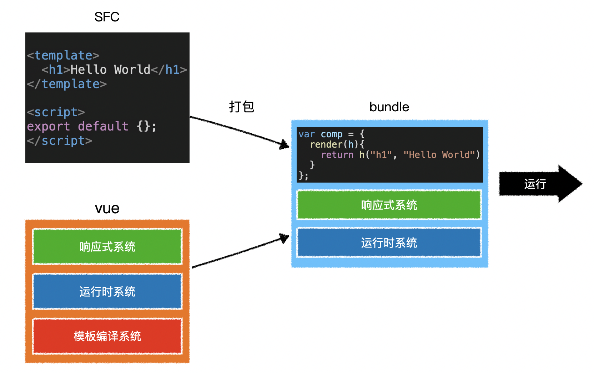

# 模版预编译

> 在Vue工程化项目中，使用构建工具打包时，会将模版编译为`render`函数，称之为“**预编译**”。
>
> 这样做的好处：
>
> - 减少了打包的体积，打包的代码中不再需要Vue模版编译器代码。（仅需Vue响应式代码和Vue运行时代码）
> - 减少了Vue首次渲染的时间，生成虚拟DOM的过程，不再需要编译模版。

页面的首次渲染，去生成虚拟DOM，会增加页面渲染的时间。