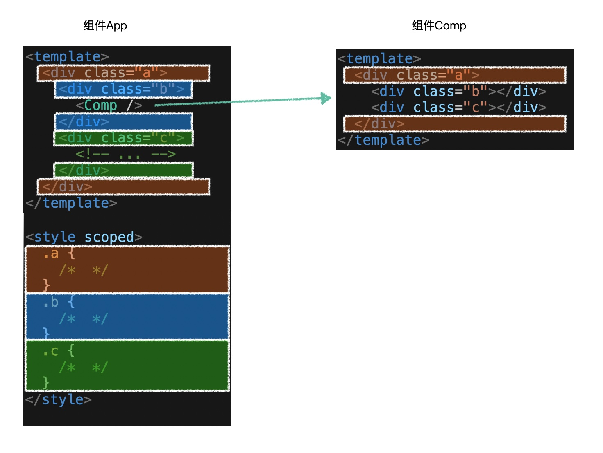

# 解决类样式冲突

为解决Vue组件类样式冲突问题，Vue通过脚手架以**作用域样式**的形式解决。

1. 启用作用域样式

   ```vue
   <style scoped>
       /* 组件样式 */
   </style>
   ```

2. 为组件生成一个`hash值`，给组件每个元素添加`data-hash值`属性。例如：

   ```css
   <div class="test" data-v-dc87507c>
       <p data-v-dc87507c>姓：李</p>
       <p data-v-dc87507c>名：进</p>
       <p data-v-dc87507c>全名：李 进</p>
   </div>
   
   .test[data-v-dc87507c] {
       /* 类样式 */
   }
   ```

3. 父组件作用域样式对子组件的影响，仅限于子组件的根元素。例如：

```vue
<!-- Parent component -->
<template>
	<div class="parent">
    	<h2>标题：Parent组件</h1>
		<Child />
	</div>
</template>
<script>
export default{};
</script>
<style scoped>
    .child {
        color: #0f0;
    }
</style>

<!-- Child component -->
<template>
	<div class="child">
    	<h2>标题：Child组件</h1>
	</div>
</template>
<script>
export default{};
</script>
<style scoped>
    .child {
        color: #f00;
    }
</style>
```

生成的HTML代码和CSS代码：

```html
<!-- html 代码 -->
<div data-eb123 class="parent">
    <h2 data-eb123>标题：Parent组件</h1>
	<div data-eb123 data-cd124 class="child">
    	<h2 data-cd124>标题：Child组件</h1>
	</div>
</div>
```

```css
/* css 代码 */
.child[data-eb123] {
	color: #0f0;
}
.child[data-cd124] {
	color: #f00;
}
```




