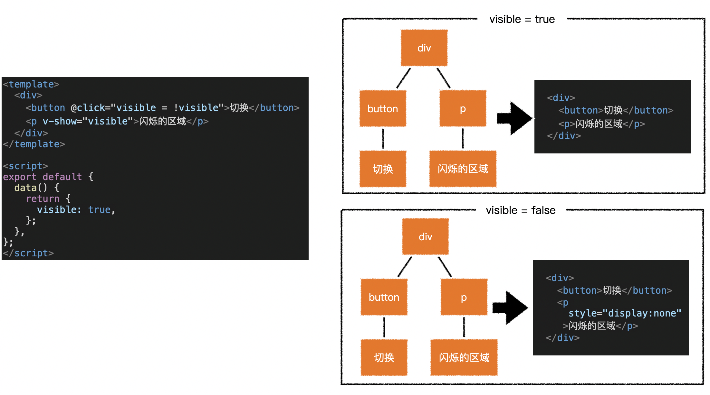

# v-if和v-show指令

> **视觉效果**：显示或隐藏元素内容。
>
> **虚拟DOM树的渲染效率**是由：**树的稳定性**和**节点数量**决定的。节点数量越少，则渲染量越少。
>
> 从以下几方面，说明`v-if`和`v-show`差异：
>
> - 技术层面：虚拟DOM树稳定性、虚拟DOM树节点数量。
> - 应用层面。


## v-if指令

> 当`v-if`为`true`时，会生成对应的`vnode`，也会生成对应的真实DOM。
>
> 当`v-if`为`false`时，不会生成对应的`vnode`。虚拟DOM树的节点减少，渲染量减少。同时带来了虚拟DOM树不稳定。
>
> **应用**：适用于显示状态变化相对较少的场景。

```html
<div id="app">
    <p v-if="true">A</p>
    <p v-else-if="false">B</p>
    <p v-else>C</p>
</div>
```


## v-show指令

> 不管`v-show`为`true`还是`false`，对应的`vnode`和真实DOM都会生成。带来了虚拟DOM树的稳定性，同时也增加了节点和渲染量。
>
> 当`v-show`为`true`时，移除真实DOM元素`display: none`，来显示元素内容。
>
> 当`v-show`为`false`时, 设置真实DOM元素`display: none`，来隐藏元素内容。
>
> **应用**：适合于频繁切换显示状态的场景。

```html
<div id="app">
    <p v-show="true">A</p>
    <p v-show="false">B</p>
</div>
```




