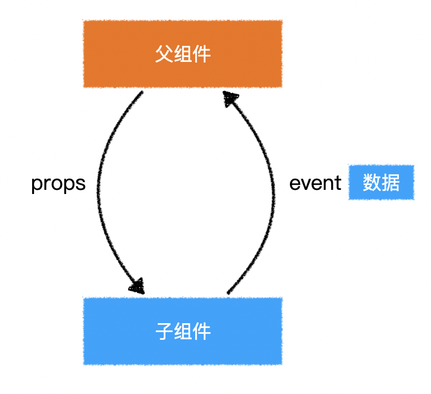

# 组件事件



**组件通信**：

- 父组件 => 子组件，通过组件属性（props）。
- 子组件 => 父组件，通过组件事件。

子组件发生一件事，自身无法处理，抛出一个事件让父组件处理。在抛出事件的过程中，通过事件参数，向父组件传递数据。父组件要处理子组件抛出的事件，需要在子组件上注册事件。通过事件对象`$event`接收子组件传递的数据。

> 子组件通过`$emit（'事件名', 数据）`来抛出事件。

1. **子组件向父组件抛出一个事件**

   ```vue
   // Child组件抛出一个事件
   <template>
   	<div class="child-container" @click="handleClick()"></div>
   </template>
   <script>
   export default {
       methods: {
           handleClick() {
               this.$emit('switchPage', 传递的数据);
           }
       }
   };
   </script>
   ```

   

2. **父组件在子组件上注册抛出的事件**

   ```vue
   // Parent组件
   <template>
   	<Child @switchPage="handleSwitchPage($event)">
   </template>
   <script>
   export default {
       methods: {
           handleSwitchPage(newPage){
               
           }
       }
   };
   </script>
   ```

   