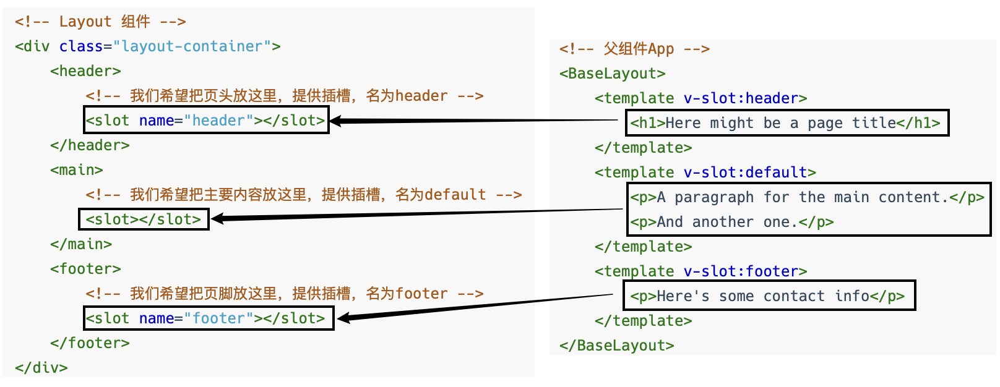

# 插槽

> 组件腾出地方，接收外部传入的内容。


```html
<!-- message组件：一个弹窗消息 -->
<div class="message-container">
    <div class="content">
        <!-- 这里是消息内容，可以是一个文本，也可能是一段html，具体是什么不知道，需要父组件指定 -->
    </div>
    <button>确定</button>
    <button>关闭</button>
</div>
```

## 插槽简单用法

>`slot`是**Vue内置组件**，用于插槽占位。`name`定义插槽的名称，默认为`default`。
>
>```html
><slot name="default"></slot>
>```

```html
<!-- message组件：一个弹窗消息 -->
<div class="message-container">
    <div class="content">
        <!-- slot是vue的内置组件 -->
        <slot></slot>
    </div>
    <button>确定</button>
    <button>关闭</button>
</div>

<!-- 父组件App -->
<Message>
    <div class="app-message">
        <p>App Message</p>
        <a href="">detail</a>
    </div>
</Message>

<!-- 最终的结果 -->
<div class="message-container">
    <div class="content">
        <div class="app-message">
            <p>App Message</p>
            <a href="">detail</a>
        </div>
    </div>
    <button>确定</button>
    <button>关闭</button>
</div>
```


## 具名插槽

> 如果某个组件中需要父组件传递多个区域的内容，也就需要提供多个插槽。
>
> 为了避免冲突，就需要给不同的插槽赋予不同的名字。
>
> `v-slot:插槽名`可以简写为`#插槽名`

```html
<!-- Layout 组件 -->
<div class="layout-container">
    <header>
        <!-- 我们希望把页头放这里，提供插槽，名为header -->
        <slot name="header"></slot>
    </header>
    <main>
        <!-- 我们希望把主要内容放这里，提供插槽，名为default -->
        <slot></slot>
    </main>
    <footer>
        <!-- 我们希望把页脚放这里，提供插槽，名为footer -->
        <slot name="footer"></slot>
    </footer>
</div>

<!-- 父组件App -->
<BaseLayout>
    <template v-slot:header>
        <h1>Here might be a page title</h1>
    </template>
    <template v-slot:default>
        <p>A paragraph for the main content.</p>
        <p>And another one.</p>
    </template>
    <template v-slot:footer>
        <p>Here's some contact info</p>
    </template>
</BaseLayout>
```




