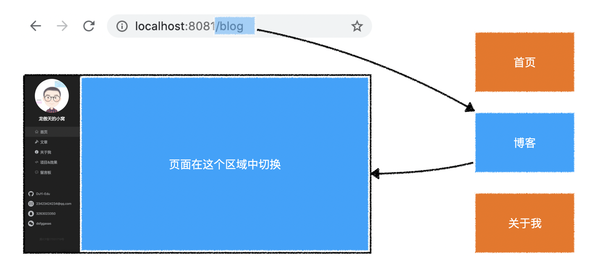
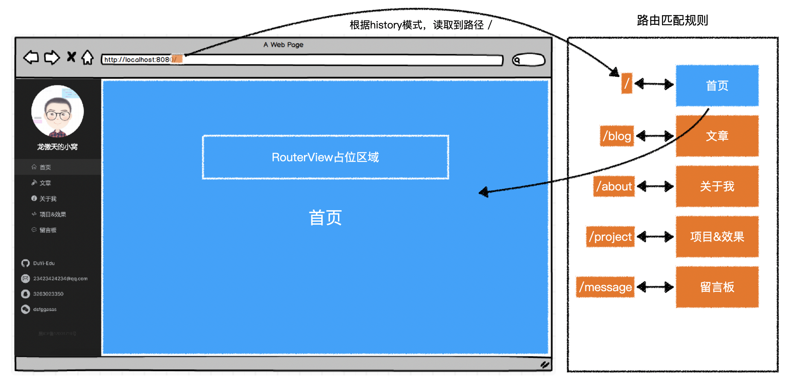
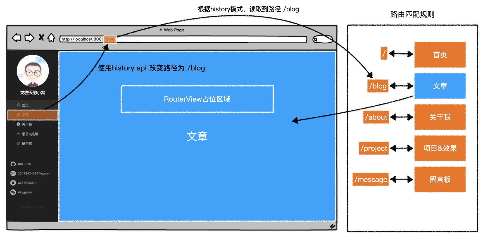

# 路由

>**在Vue中导航切换的是组件**。（在Vue中一切内容都是通过JS创建的）
>
>路由解决以下问题：
>
>1. 定位组件切换的位置。
>2. 根据`url`进行无刷新切换组件。
>3. 切换导航无刷新无跳转的更改`url`。
>4. 导航匹配。
>5. ...
>
>> **vue-router 官网**：https://router.vuejs.org/zh/



1. 如何根据`url`中的`pathname`选择不同的组件？
2. 把选择的组件放到哪个位置？
3. 如何无刷新的切换组件？


## 路由插件(vue-router)

### 路由插件的安装

```bash
npm i vue-router
```


### Vue中使用路由插件

> **在Vue中安装插件**：`Vue.use(插件);`，**同时会全局注册插件中的组件。**

```js
import Vue from 'vue';
import VueRouter from 'vue-router';

Vue.use(VueRouter); // 在Vue中安装vue-router插件

const router = new VueRouter({
    // 路由配置
});

const vm = new Vue({
    router, // 注入路由实例，作为Vue实例的成员，以便在Vue实例或组件实例中使用
    // ...
});
```


### 基本使用

#### 定位组件放置位置

> 使用`vue-router`全局注册的`router-view`组件，定位路由切换的位置。下文使用的是组件大驼峰命名`RouterView`，也可以使用短横线命名`router-view`。

```html
<!-- App.vue -->
<div class="container">
    <div>
        <!-- 公共区域 -->
    </div>
    <div>
        <!-- 页面区域 -->
        <!-- vue-router 匹配到的组件会渲染到这里 -->
        <RouterView />
    </div>
</div>
```


#### 路由匹配规则配置`routes`

> 当匹配什么`pathname`是，切换什么组件。

```js
const router = new VueRouter({
   // 路由规则配置
   routes: [
       // 当匹配到路径 '/foo' 时，渲染 Foo 组件
       { path: '/foo', component: Foo },
       // 当匹配到路径 '/bar' 时，渲染 Bar 组件
       { path: '/bar', component: Bar }
   ] 
});
```


### 路由模式`mode`

> 路由模式决定了：
>
> 1. 路由从哪里获取访问路径。
> 2. 路由如何改变访问路径。
>
> `vue-router`提供了三种路由模式：
>
> 1. `hash`：**默认值**。路由从浏览器地址栏中的`hash`部分获取路径，改变路径也是改变`hash`部分。（更改`hash`不会刷新页面，会触发`hashchange`事件）
>
>    ```markdown
>    http://localhost:8081/#/blog  -->  /blog
>    http://localhost:8081/about#/blog  --> /blog
>    ```
>
> 2. `history`：路由从浏览器地址栏中的`pathname`部分获取路径，改变路径也是改变`pathname`部分。通过history API(`pushState`)更改路径，不会刷新页面，但会触发`popstate`事件。
>
>    ```markdown
>    http://localhost:8081/#/blog  -->  /
>    http://localhost:8081/about#/blog  --> /about
>    http://localhost:8081/blog  --> /blog
>    ```
>
> 3. `abstract`：路由从内存中获取路径，改变路径也只是改变内存中的值，（通常应用在非浏览器环境中）
>
>    ```markdown
>    内存： /			-->   /
>    内存： /about	--> /about
>    内存： /blog	  --> /blog
>    ```


### 导航

>通过导航无刷新改变路径，再由路由根据路径匹配组件，切换组件。
>
>`vue-router`全局注册了`router-link`组件，它的渲染结果是一个`a`元素。
>
>```html
><RouterLink to="/blog">文章</RouterLink>
><!-- mode: hash 生成-->
><a href="#/blog">文章</a>
><!-- mode: history 生成-->
><a href="/blog">文章</a>
>```
>
>为了避免刷新页面，给`a`元素注册了点击事件，并阻止了默认行为。





#### 导航激活状态

> **默认情况下**，`vue-router`会用 `当前路径` 匹配 `导航路径`：
>
> - 如果**当前路径**是以**导航路径**开头的，则**算作匹配**，会为导航的`a`元素添加`router-link-active`类名。（匹配）
> - 如果**当前路径**完全等于**导航路径**，则**算作精确匹配**，会为导航的`a`元素添加`router-link-exact-active`类名。（精确匹配）
>
> **例如**，当前访问的路径是`/blog`，则：
>
> | 导航路径 | 类名                                       |
> | -------- | ------------------------------------------ |
> | /        | router-link-active                         |
> | /blog    | router-link-active、router-link-exact-link |
> | /about   | 无                                         |
> | /message | 无                                         |
>
> 可以为`router-link`组件添加布尔属性`exact`，将匹配规则改为：必须要精确匹配才能添加匹配类名`router-link-active`。(精确匹配同时会添加`router-link-exact-active`类名)
>
> **例如**，当前访问的路径是`/blog`，则：
>
> | 导航路径 | exact | 类名                                         |
> | -------- | ----- | -------------------------------------------- |
> | /        | true  | 无                                           |
> | /blog    | false | router-link-active、router-link-exact-active |
> | /about   | true  | 无                                           |
> | /message | true  | 无                                           |
>
> **例如**，当前访问的路径是`/blog/detail/123`，则：
>
> | 导航路径 | exact | 类名               |
> | -------- | ----- | ------------------ |
> | /        | true  | 无                 |
> | /blog    | false | router-link-active |
> | /about   | true  | 无                 |
> | /message | true  | 无                 |
>
> 可以通过`router-link`组件的`active-class`属性更改匹配的类名，通过`exact-active-class`更改精确匹配的类名。


### 命令路由

> 使用命名路由可以解除系统与路径之间的耦合。

**路由配置**：

```js
const router = new VueRouter({
    routes: [
        // 路由规则
    	// 当匹配到路径 /foo 时，渲染 Foo 组件
    	{ name: 'foo', path: '/foo', component: Foo },
    	// 当匹配到路径 /bar 时，渲染 Bar 组件
    	{ name: 'bar', path: '/bar', component: Bar },
    ]
});
```

**导航配置**

```js
<!-- 向to属性传递路由信息对象 RouterLink会根据你传递的信息以及路由配置生成对应的路径 -->
<RouterLink :to="{ name:'foo' }">go to foo</RouterLink>
```


