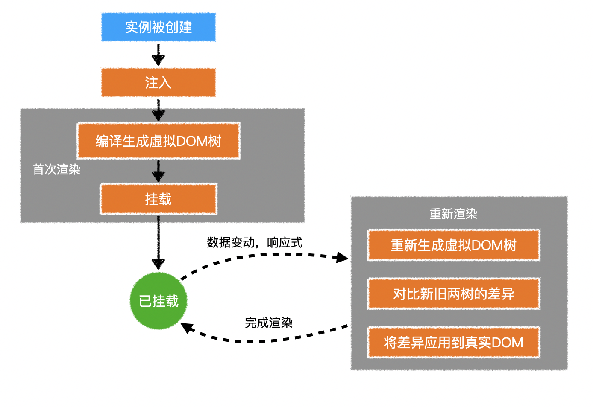
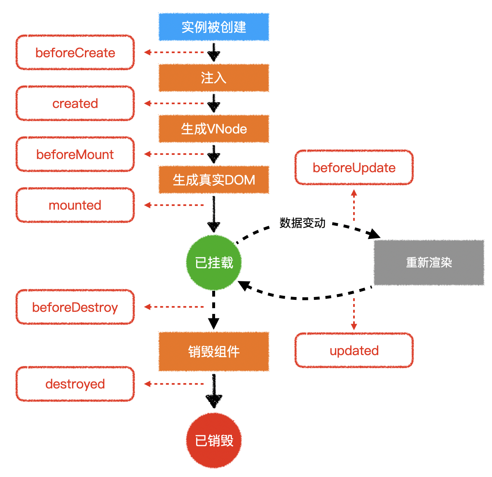

# 组件生命周期





> 页面未依赖的数据改变，不会重新渲染。

```js
const Comp = {
    data(){
        return {}
    },
    beforeCreate(){},
    created(){},
    beforeMount(){},
    mounted(){},
    beforeUpdate(){},
    updated(){},
    beforeDestroy(){},
    destroyed(){}
}
```

- 远程获取数据、开启定时器可以在`created`
- 操作DOM可以在`mounted`
- 清除定时器可以在`destroyed`