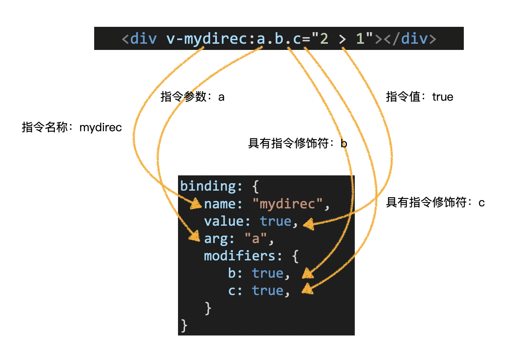

# 自定义指令

> [参考官网](https://cn.vuejs.org/v2/guide/custom-directive.html)
>
> 在Vue中指令是根据一个配置对象创建的。开发一个自定义指令，实际上是编写一个指令配置对象。

```js
const myDirec = {
    // 指令配置对象
};
```


## 指令配置对象

Vue支持在指令中配置一些**钩子函数**。在适当的时机，Vue会调用这些**钩子函数**并**传入适当的参数**。


### 钩子函数

**常用的钩子函数**：

- `bind`：**只调用一次**，**当指令第一次绑定到元素时调用**。（在这里可以进行一次性的初始化设置）
- `inserted`：**被绑定元素插入父节点时调用**。（仅保证父节点存在，但不一定已被插入文档中）
- `update`：**所在组件的vnode更新时调用**，可能发生在其子vnode更新之前。（指令的值可能发生了改变，也可能没有）


**其他钩子函数**：

- `componentUpdated`：**指令所在组件的vnode及其子vnode全部更新后调用**。
- `unbind`：只调用一次，指令与元素解绑时调用。


### **钩子函数参数**

- `el`：**指令所绑定的元素**，可以用来直接操作DOM。
- `binding`：一个对象，描述指令的信息。



- `vnode`：虚拟节点。
- `oldNode`：上一个虚拟节点，仅在`update`和`componentUpdated`钩子函数中使用。


> 每个钩子函数在调用时，`Vue`都会向其传递一些参数，其中最重要的是前两个参数。

```js
const myDirect = {
    // 指令配置对象
  	bind(el, binding){
        
    },
    inserted(el, binding){
        
    },
    update(el, binding){
        
    },
    componentUpdated(el, binding){
        
    },
    unbind(el, binding){
        
    }
};
```


## 配置简化

> 在配置自定义指令时，一般都会配置`bind`、`update`钩子函数。在元素绑定和更新时，都能运行到钩子函数。
>
> 如果这两个钩子函数实现的功能相同，且不配置其他钩子函数，可以直接把指令配置简化为一个单独的函数：

```js
function(el, binding){
    // 该函数会被同时设置到bind和update中
}
```


## 指令注册

> 自定义指令支持全局注册和局部注册。
>
> - **全局注册的指令，能在任何组件的模版中使用。**
>
> - **局部注册的指令，仅限于注册组件的模板中使用。**
>
> **注意**：仅全局使用的指令，全局注册。（全局注册，使用方便，同时会增加构建工具打包的体积）


### 全局注册

```js
// 全局注册指令
Vue.directive('指令名', 指令配置对象);
```


### 局部注册

> 在组件中注册自定义指令：

```js
const MyComp = {
    directives: {
        '指令名': 指令配置对象
    }
};
```


