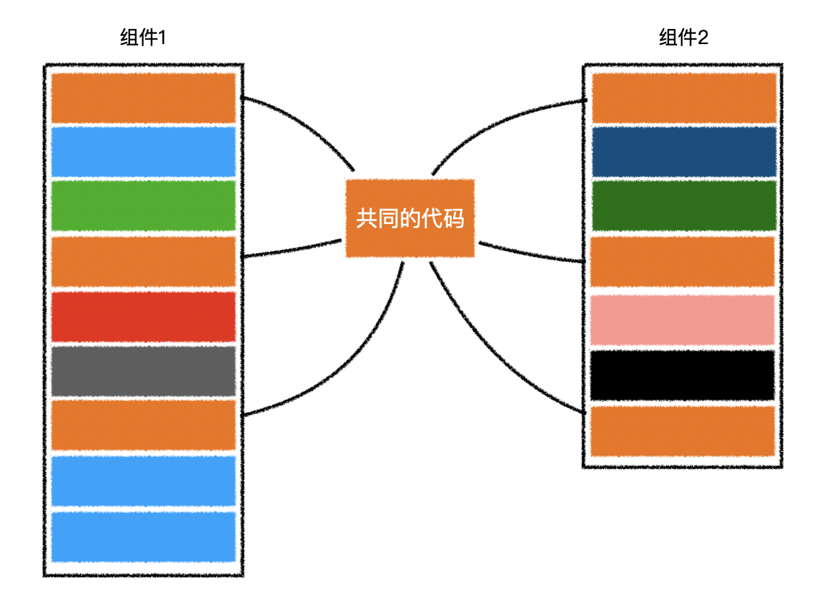
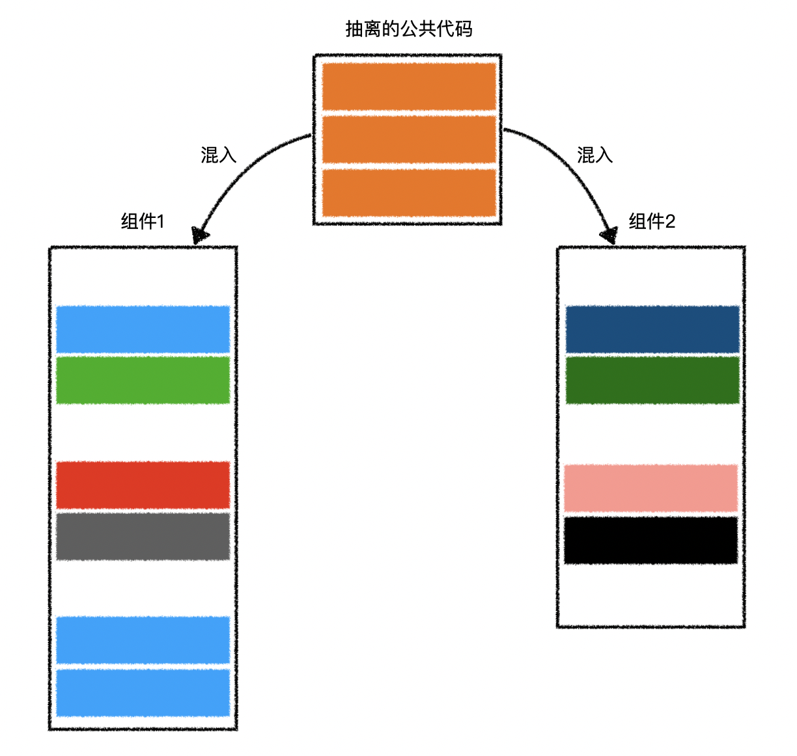

# 组件混入

> [官网参考](https://cn.vuejs.org/v2/guide/mixins.html)
>
> **组件混入目的**：抽离各个组件中公共代码，通过组件混入，融入到组件中。



> 抽离的公共代码，本身是一个组件配置对象，具有组件的配置。

例如：抽离的公共代码

```js
// 抽离的公共代码
const Common = {
    data() {
        return {
            a: 1,
            b: 2
        }
    },
    computed: {
        sum() {
            return this.a + this.b;
        }
    },
    created() {
        console.log("common created");
    },
};
```

混入到组件配置中：

```js
const MyComp = {
    mixins: [Common] // 之所以是数组，是因为可以混入多个配置代码
    created() {
        console.log("MyComp created", this.a, this.b, this.sum);
    }
}

```

## 混入合并

> 1. 数据对象在内部会进行递归合并，并在发生冲突时以组件数据优先。
> 1. 同名钩子函数会合并为一个数组，都将被调用。混入对象的钩子将在组件自身钩子之前调用。
> 1. 值为对象的选项（`methods`、`components`、`directives`），将被合并为同一个对象。两个对象键名冲突时，取组件对象的键值对。


## 全局混入

> 混入也可以进行全局注册。一旦使用全局混入，它将影响每一个之后创建的实例。

```js
Vue.mixin(混入对象);
```


