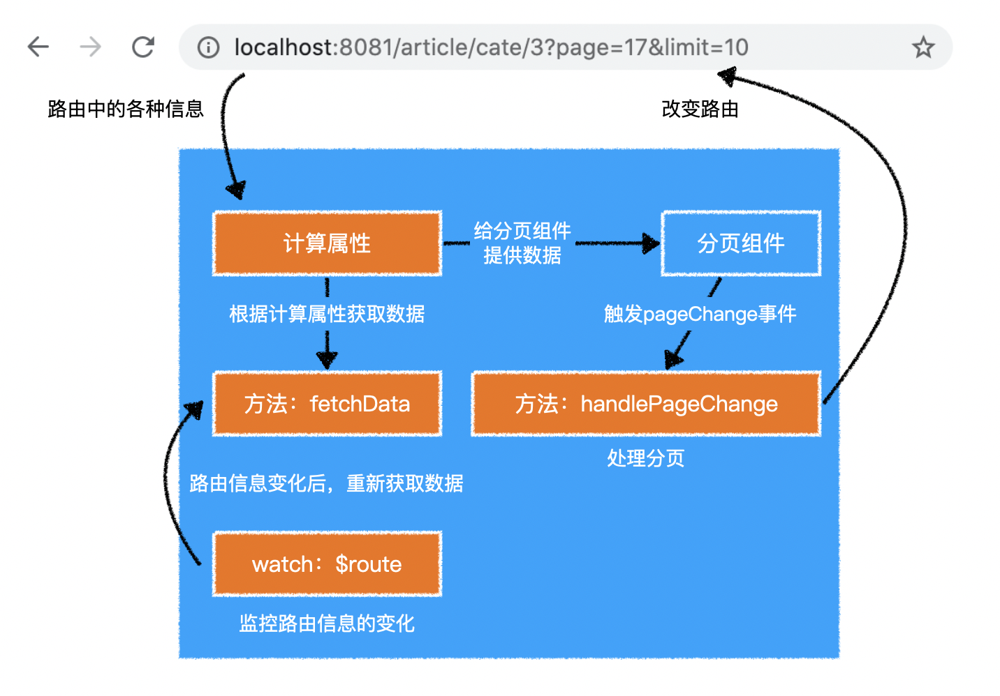

# 路由跨组件通信

> 通过`Vue.use（）`使用`vue-router`时：
>
> 1. 通过`Vue.component()`全局注册了`router-view`和`router-link`组件。
> 2. 将`$router`和`$route`注入到了`Vue.prototype`中。
>
> 能通过`$router`，以编码的方式进行路由的操作（跳转、重定向、导航守卫等）。
>
> 能通过`$route`，获取最新的路由信息。




## 通过`$route`获取路由信息

> 通过计算属性，获取路由信息。路由信息，是计算属性依赖的数据之一。当路由信息变更后，依赖的计算属性，会再次调用`getter`方法，获取最新的路由信息，并更新缓存。


## 监听`$route`

> **注意**：`$route`是一个可变对象，路由信息更改，会重新赋值一个新的路由信息对象。
>
> 可以直接通过`watch`，监听`$route`。
>
> `watch`仅能监听组件依赖数据：路由信息、组件属性、响应式数据等。
>
> 通过监听数据，做一些事情。

```js
export default {
    // ... 其他配置
    watch: {
        // 观察 this.$route 的变化，变化后，会调用该函数
        $route(newVal, oldVal) {
            // newVal：this.$route 新的值，等同 this.$route
            // oldVal：this.$route 旧的值
        },
        // 完整写法
        $route: {
            handler(newVal, oldVal) {},
            deep: false, // 是否监听该数据内部属性的变化，默认 false
            immediate: false // 是否立即执行一次 handler，默认 false
        }
        // 观察 this.$route.params 的变化，变化后，会调用该函数
        ["$route.params"](newVal, oldVal) {
            // newVal：this.$route.params 新的值，等同 this.$route.params
            // oldVal：this.$route.params 旧的值
        },
        // 完整写法
        ["$route.params"]: {
            handler(newVal, oldVal) {},
            deep: false, // 是否监听该数据内部属性的变化，默认 false
            immediate: false // 是否立即执行一次 handler，默认 false
        }
    }
}

```


