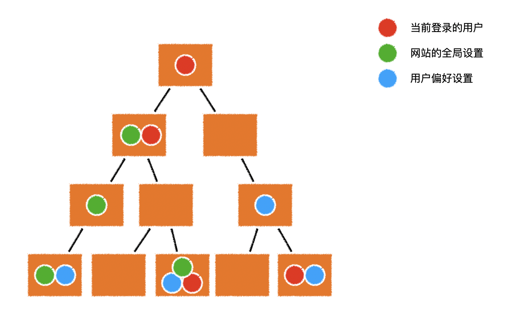
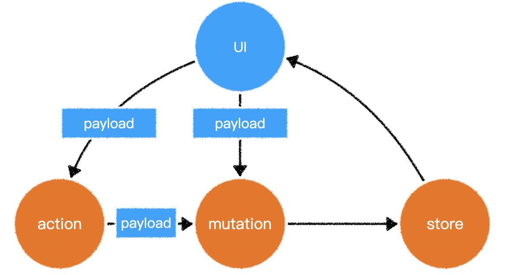

# vuex简介



数据共享、状态管理、数据仓库，全局状态管理、局部状态管理。

> - 数据**唯一性**。
> - 数据**响应式**，数据仓库中数据变更，凡是依赖的地方都会同步变更。
> - **数据独立**，用于自己的同步更改数据、异步更改数据的方式，并能被追踪到。（数据仓库是独立的，可以在组件或普通的JS模块中使用）

事件总线在于“**通知**”，数据仓库在于"**数据共享**"或"**状态管理**"。

**需要注意**：凡是要更改数据仓库中的数据，必须得使用仓库提供的方法。 


## 使用vuex

```js
// store.js
import Vuex from 'vuex';
import Vue from 'vue';

Vue.use(Vuex); // 应用vuex插件

const store = new Vuex.Store({
    // 数据仓库配置
    state: {
        // 仓库的初始状态（数据）
        count: 0
    }
});

export default store;
```

> 数据仓库创建好后，你可以使用`store.state`来访问仓库中的数据。（**仅限访问**）
>
> 如果希望在`vue`中方便的使用仓库中的数据，需要将`vuex`作为插件安装。

```js
// store.js
import Vuex from 'vuex';
import Vue from 'vue';
Vue.use(Vuex); // 安装Vuex插件
const store = new Vuex({
    // 仓库的配置
    state: {
        // 仓库的初始状态（数据）
        count: 0,
    },
});

export default store;

// main.js
import Vue from 'vue';
import App from './App.vue';
import store from './store.js';
new Vue({
    store, // 向vue中注入仓库
    render: (h) => h(App),
}).$mount('#app');
```

> 之后，在`vue`组件中，可以通过实例的`$store`属性访问到仓库。
>
> `Vuex`会自动将配置的状态数据设置为响应式数据。当数据变化时，依赖该数据的组件会自动渲染。


## 数据变更

> **强烈不推荐，直接更改状态数据。**（数据更改无法被追踪，在复杂场景下，代码调试很困难）
>
> 为了能够更好的跟踪数据的变化，`vuex`强烈建议使用`mutation`来更改数据。

```js
const store = new Vuex({
    // 仓库的配置
    state: {
        // 仓库的初始状态（数据）
        count: 0,
    },
    mutations: {
        /**
         * 每个mutation是一个方法，它描述了数据在某种场景下的变化
         * increase mutation描述了数据在增加时应该发生的变化
         * 参数state为当前的仓库数据
         */
        increase(state) {
            state.count++;
        },
        decrease(state) {
            state.count--;
        },
        /**
         * 求n次幂
         * 该mutation需要一个额外的参数来提供指数
         * 我们把让数据产生变化时的附加信息称之为负荷（负载） payload
         * payload可以是任何类型，数字、字符串、对象均可
         * 在该mutation中，我们约定payload为一个数字，表示指数
         */
        power(state, payload) {
            state.count **= payload;
        },
    },
});
```

通过`store.commit`方法提交一个`mutation`，具体做法：

```js
store.commit('mutation的名字', payload);
```


**特别注意： **

1. `mutation`中不得出现异步操作

   > 在实际开发的规范中，甚至要求不得有副作用操作
   >
   > 副作用操作包括：
   >
   > - 异步
   > - 更改或读取外部环境的信息，例如`localStorage、location、DOM`等

2. 提交`mutation`是数据改变的**唯一原因**


## 异步处理

如果在`vuex`中要进行异步操作，需要使用`action`

```js
const store = new Vuex({
    state: {
        count: 0,
    },
    mutations: {
        increase(state) {
            state.count++;
        },
        decrease(state) {
            state.count--;
        },
        power(state, payload) {
            state.count **= payload;
        },
    },
    actions: {
        /**
         * ctx: 类似于store的对象
         * payload: 本次异步操作的额外信息
         */
        asyncPower(ctx, payload) {
            setTimeout(function() {
                ctx.commit('power', payload);
            }, 1000);
        },
    },
});
```




