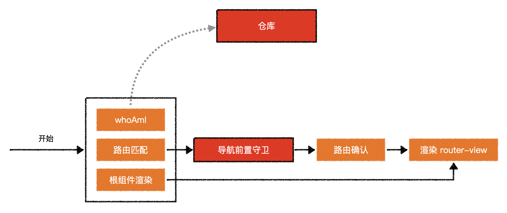
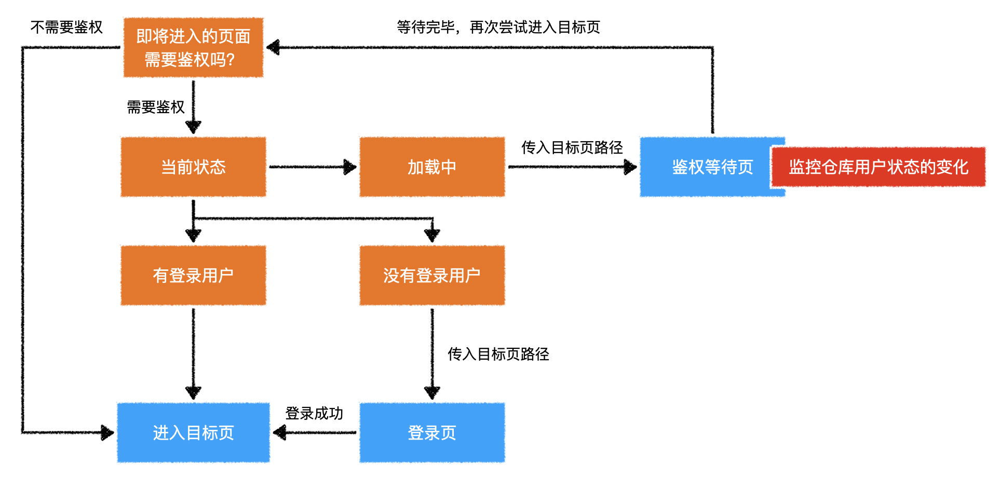

## 全局导航前置守卫

> **最开始进行**：
>
> 1. 从数据仓库或服务器验证登录状态。
> 2. 路由匹配。
> 3. 根组件渲染。

### 鉴权守卫逻辑示意图

> - 登录中、已登录、未登录。
>   - 登录中：显示loading。
>   - 已登录：显示用户信息、退出。
>   - 未登录：显示登录。
> - 路由规则是从上往下匹配的，一般在最后匹配`*`，将找不到的页面皆匹配到`NotFound`组件。

- `router.beforeEach`：进行全局的前置导航守卫。（还未确认跳转的路由，待确认）
  - 鉴权
  - 重定向
  - ...
  - 网页图标
- `router.afterEach`：进行全局的后置导航守卫。（已确认跳转的路由，还未跳转到）
  - 页面标题
  - ...

> **需要注意**：在前置导航守卫执行时，恢复登录状态可能还未完成。

## vue

[watch配置](https://cn.vuejs.org/v2/api/#watch)

[Vue.prototype.$watch](https://cn.vuejs.org/v2/api/#vm-watch)

## vuex

[mapState](https://vuex.vuejs.org/zh/guide/state.html#mapstate-%E8%BE%85%E5%8A%A9%E5%87%BD%E6%95%B0)

[getters](https://vuex.vuejs.org/zh/guide/getters.html)

[mapGetters](https://vuex.vuejs.org/zh/guide/getters.html#mapgetters-%E8%BE%85%E5%8A%A9%E5%87%BD%E6%95%B0)

[modules](https://vuex.vuejs.org/zh/guide/modules.html)

[watch](https://vuex.vuejs.org/zh/api/#watch)

## router

[exact-path:](https://router.vuejs.org/api/#exact-path)：仅使用路径精确匹配，忽略`hash`、`query`。`exact`：精确匹配，但是不会忽略`hash`、`query`。

[导航守卫](https://router.vuejs.org/zh/guide/advanced/navigation-guards.html#%E5%85%A8%E5%B1%80%E5%89%8D%E7%BD%AE%E5%AE%88%E5%8D%AB)

