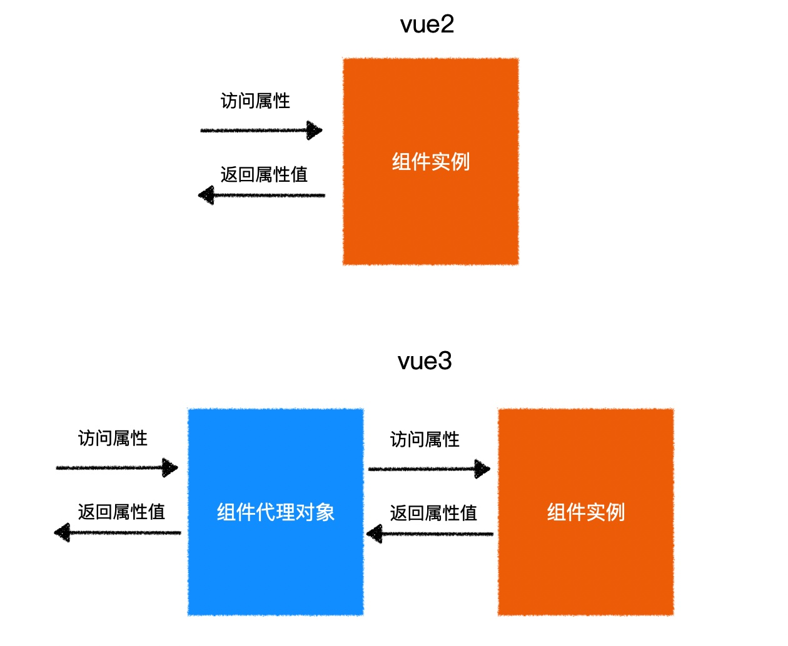
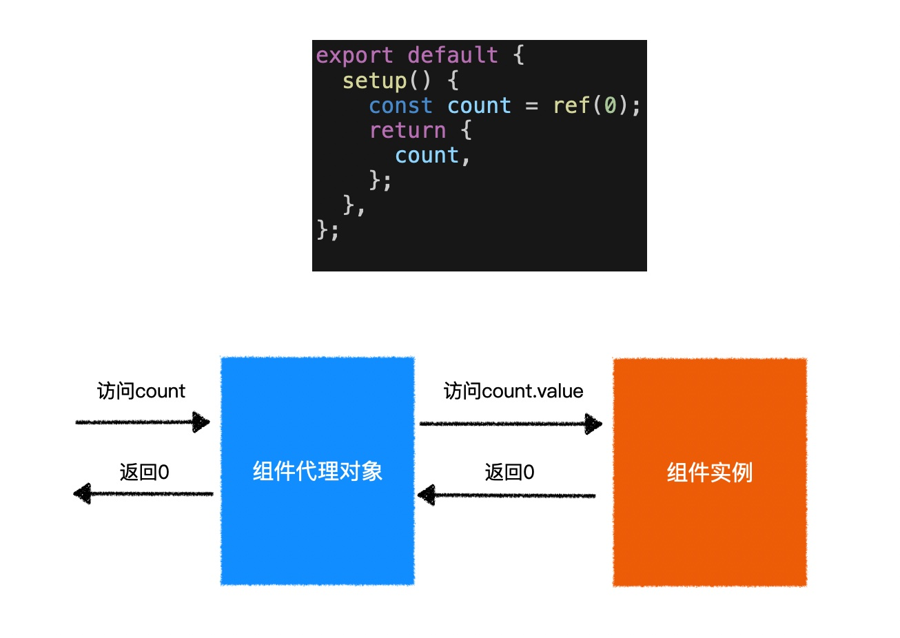

# vue3重大变化

## 创建vue实例

### vue2

```js
import Vue from 'vue';
import App from './App.vue';

const vm = new Vue({
    // vue配置对象
    render: h => h(App)
});

vm.$mount('#app');
```


### vu3

```js
import { createApp } from 'vue';
import App from './App.vue';

const app = createApp(App);

app.mount('#app');
```


- 不再存在`Vue`构造器，通过`createApp`方法创建`Vue`实例。


## 使用插件

### vue2

```js
import Vue from 'vue';

Vue.use(插件);
```


### vue3

```js
import { createApp } from 'vue';
import App from './App.vue';

const app = createApp(App);
app.use(插件);

app.mount('#app');
```


## 组件内

### `option api`

```vue
<template>
	<p>{{ count }}</p>
	<button @click="increaseCount()">count++</button>
	<button @click="decreaseCount()">count--</button>
</template>

<script>
export default {
    data: () => ({
        count: 0
    }),
    methods: {
        increaseCount() {
            this.count++;
        },
        decreaseCount() {
            this.count--;
        }
    }
}
</script>
```

- `vue3`模版中支持多根节点，`vue2`模版中仅支持单根节点。

- `vue3`模版中使用的是`代理的组件实例对象`，`vue2`模版中使用的是`组件实例对象`。

- `vue3`的方法、生命周期钩子函数、计算属性内，`this`指向`代理的组件实例对象`。

- `vue2`的方法、生命周期钩子函数、计算属性内，`this`指向`组件实例对象`。

  


- `option api`特点：高耦合，低内聚。各种业务功能穿插，比较零散。[option api](./assets/images/option%20api.jpeg)


### `composition api`

#### setup方法

```vue
<script>
export default {
    setup(){
        console.log('在组件所有生命周期钩子函数之前执行（在beforeCreate之前执行）');
        consolee.log(this, 'undefined');
        console.log('返回值会注入到组件实例中');
        
        let count = 0; // 非响应式数据
        const increaseCount = () => {
            count++;
            console.log('increaseCount', count);
        };
        
        const decreaseCount = () => {
            count--;
            console.log('decreaseCount', count);
        };
        
        return {
            count,
            increaseCount,
            decreaseCount
        }
    }
}
</script>
```


> - 在组件所有生命周期钩子函数之前执行。（在`beforeCreate`之前执行）
> - `setup`方法的返回值，会注入到组件实例中。
> - `setup`返回值内的数据，不是响应式的，注入到组件实例中也不是响应式的。
> - `setup`方法内，`this`始终指向`undefined`。
> - 组件生命周期钩子函数`beforeCreate`内，能访问到`setup`返回值注入到组件实例中的成员。


### ref方法，定义响应式数据

```js
<script>
import { ref } from 'vue';
export default {
	setup() {
		const countRef = ref(0);

		const increaseCountRef = () => {
			countRef.value += 1;

			console.log('increaseCount', countRef.value, countRef);
		};
		const decreaseCountRef = () => {
			countRef.value -= 1;

			console.log('decreaseCount', countRef.value, countRef);
		};

		return {
			countRef,
			increaseCountRef,
			decreaseCountRef
		};
	}
}
</script>

<template>
	<p>{{ countRef }}</p>
	<p>
		<button @click="increaseCountRef">count++</button>
		<button @click="decreaseCountRef">count--</button>
	</p>
</template>

```




