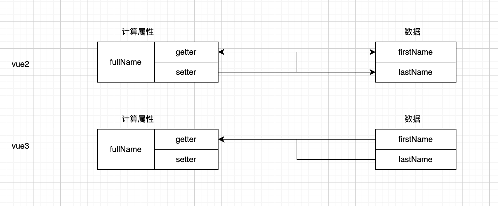

## `watchEffect`

> `watchEffect(callback)`：监听副作用，记录依赖的数据。当依赖的数据发生改变后，会执行`callback`函数。

```js
import { watchEffect } from 'vue';

watchEffect(() => {
    
});
```


## 生命周期函数

> `onMounted(callback)`：组件挂载完成的生命周期函数。
>
> `onUnmounted(callback)`：组件卸载后的生命周期函数。 

```js
import {onMounted, onUnmounted} from 'vue';
```


## 计算属性

> `computed(callbackFn|object)`：计算属性。
>
> - callbackFn：表示计算属性只能读取。(推荐)
> - object：可以设置计算属性的`getter`和`setter`方法。与vue2不同的是，vue3不建议通过`setter`数据。要更改数据，直接更改。

```js
import { computed } from 'vue';
```




