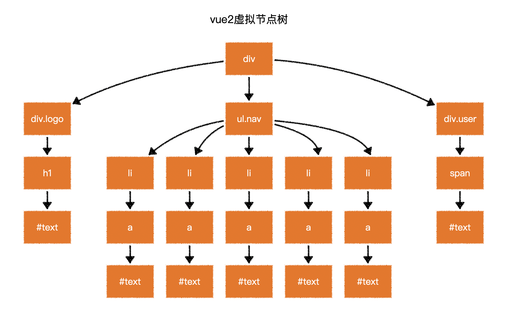
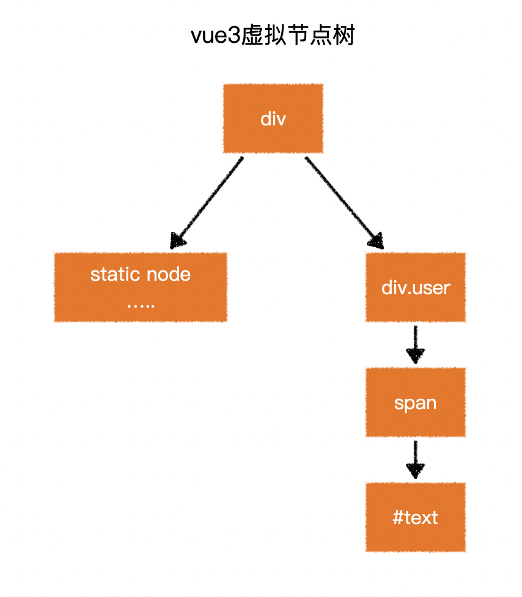
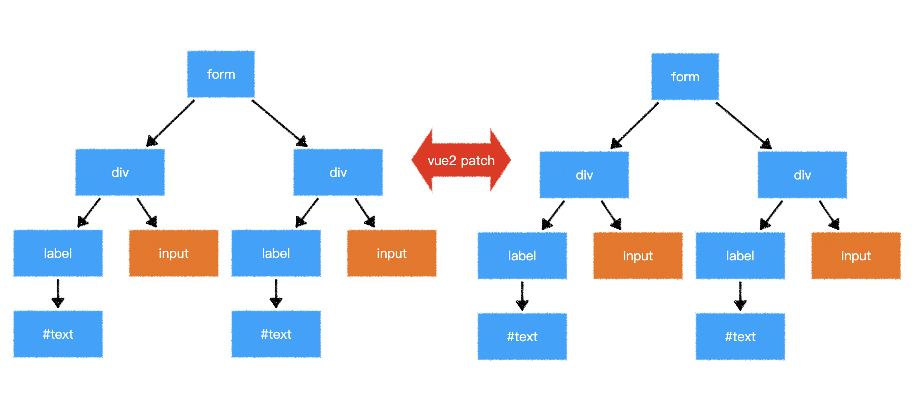
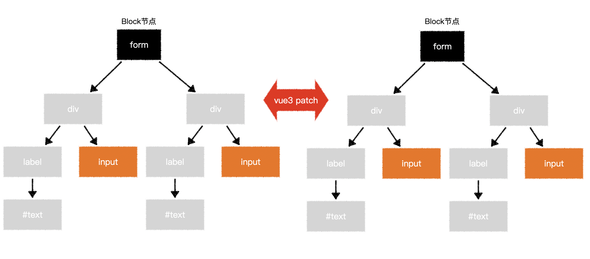
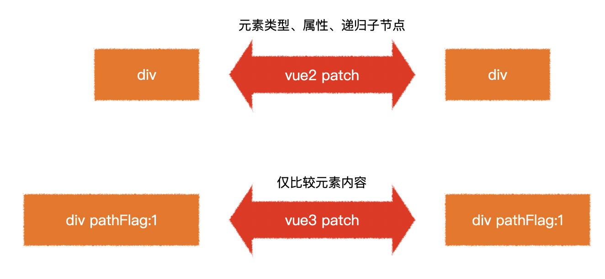

## vue3的效率提升主要表现在那些方面？

> - 静态提升
> - 预字符串化
> - 缓存事件处理函数
> - Block tree
> - patch flag

### 静态提升

> 将静态内容在模版编译时，提升到render函数外，render函数内直接使用静态提升的结果即可。
>
> 静态内容是指没有绑定动态内容的元素或属性。

没有绑定动态内容的元素：

```js
// vue2 的静态节点
render(){
  createVNode("h1", null, "Hello World")
  // ...
}

// vue3 的静态节点
const hoisted = createVNode("h1", null, "Hello World")
function render(){
  // 直接使用 hoisted 即可
}
```

没有绑定动态内容的属性：

```js
<div class="user">
  {{user.name}}
</div>
```

```js
const hoisted = { class: "user" }

function render(){
  createVNode("div", hoisted, user.name)
  // ...
}
```


### 预字符串化

> 当编译器遇到大量连续的静态内容，会直接将其编译为一个普通字符串节点。

```html
<div class="menu-bar-container">
  <div class="logo">
    <h1>logo</h1>
  </div>
  <ul class="nav">
    <li><a href="">menu</a></li>
    <li><a href="">menu</a></li>
    <li><a href="">menu</a></li>
    <li><a href="">menu</a></li>
    <li><a href="">menu</a></li>
  </ul>
  <div class="user">
    <span>{{ user.name }}</span>
  </div>
</div>
```

```js
const _hoisted_2 = _createStaticVNode("<div class=\"logo\"><h1>logo</h1></div><ul class=\"nav\"><li><a href=\"\">menu</a></li><li><a href=\"\">menu</a></li><li><a href=\"\">menu</a></li><li><a href=\"\">menu</a></li><li><a href=\"\">menu</a></li></ul>");
```





### 缓存事件处理函数

```html
<button @click="count++">plus</button>
```

```js
// vue2
render(ctx){
  return createVNode("button", {
    onClick: function($event){
      ctx.count++;
    }
  })
}

// vue3
render(ctx, _cache){
  return createVNode("button", {
    onClick: _cache[0] || (_cache[0] = ($event) => (ctx.count++))
  })
}
```

### Block tree

> vue2在对比新旧树时，并不知道那些节点是静态的，那些是动态的。因此只能一层一层比较，这就浪费了大部分时间在比对静态节点上。
>
> vue3在模版编译时，就记录了那些是静态节点，那些是动态节点。将动态节点放在根节点的Block中，因此在比较新旧树时，仅需比较根节点中的Block即可。

```html
<form>
  <div>
    <label>账号：</label>
    <input v-model="user.loginId" />
  </div>
  <div>
    <label>密码：</label>
    <input v-model="user.loginPwd" />
  </div>
</form>
```





### patch flag

> vue2在比对每一个节点时，并不知道这个节点那些相关信息会发生变化。因此只能将所有信息依次比对。
>
> vue3在模版编译时，会记录节点那些内容是变化的。因此在比对节点时，仅需比对变化的内容即可。

```html
<div class="user" data-id="1" title="user name">
  {{user.name}}
</div>
```




