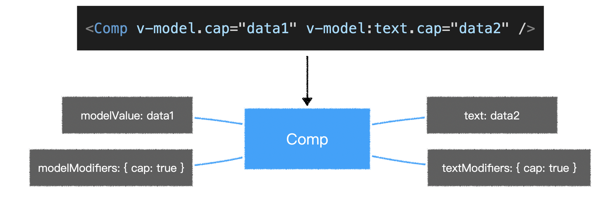

## v-model（双向绑定）

> `vue2`比较让人诟病的一点就是提供了两种双向绑定：`v-model`和`.sync`。
>
> 在`vue3`中，去掉了`.sync`修饰符，只需要使用`v-model`进行双向绑定即可。
>
> 为了让`v-model`更好的针对多个属性进行双向绑定，`vue3`作出了以下修改：

- 当对自定义组件使用`v-model`指令时，绑定的属性名由原来的`value`变为`modelValue`，事件名由原来的`input`变为`update:modelValue`。

```html
<!-- vue2 -->
<ChildComponent :value="pageTitle" @input="pageTitle = $event" />
<!--- 简写为 -->
<ChildComponent v-model="pageTitle" />

<!--- vue3 -->
<ChildComponent :modelValue="pageTitle" @update:modelValue="pageTitle = $event" />
<!-- 简写为 -->
<ChildComponent v-model="pageTitle" />
```

- 去掉了`.sync`修饰符，它原本的功能由`v-model`的参数替代。

```html
<!--- vue2 -->
<ChildComponent :title="pageTitle" @update:title="pageTitle = $event" />
<!-- 简写为 -->
<ChildComponent :title.sync="pageTitle" />

<!--- vue3 -->
<ChildComponent :title="pageTitle" @update:title="pageTitle = $event" />
<!-- 简写为 -->
<ChildComponent v-model:title="pageTitle" />
```

- `model`配置被移除
- 允许新增自定义`v-model`修饰符（vue2无此功能）



```vue
// Comp 组件

<script>
export default {
    props: {
        modelValue: {
            type: String,
            required: true
        },
        modelModifiers: {
            type: Object,
            required: false,
            default: () => ({})
        },
        text: {
            type: String,
            required: true
        },
        textModifiers: {
            type: Object,
            required: false,
            default: () => ({})
        }
    }
}
</script>
```


## v-if、v-for

> vue2中不推荐`v-if`和`v-for`一起使用，但是`v-for`优先级高于`v-if`。
>
> vue3中为了杜绝`v-if`和`v-for`一起使用，将`v-if`优先级高于`v-for`。


## key

> 在vue2中，`v-for`在`<template>`中使用时，`key`值不能添加在`<template>`中，需添加在子元素之中。
>
> 在vue3中，`v-for`在`<template>`中使用时，`key`值可以添加在`<template>`中，无需再添加在子元素中。
>
> 在vue2中，使用`v-if`、`v-else-if`、`v-else`时，vue会尽可能的复用元素。若是需要不复用元素，重新渲染元素，则需要手动添加唯一的`key`值。
>
> 在vue3中，使用`v-if`、`v-else-if`、`v-else`时，vue已经为每个分支的根元素添加唯一且稳定的`key`值，避免元素复用。若是要手动添加`key`值，也必须保证`key`值的唯一（字符串或整型数值）。若是要复用，应该从数据层面考虑，使用相同的数据。


## Fragment

> vue2的模版，不允许出现多根节点，必须得是单根节点。
>
> vue3自动为模版添加了一个虚拟的单根节点，因此在书写模版，可以多根节点。（相当于React中的React.Fragment节点）


