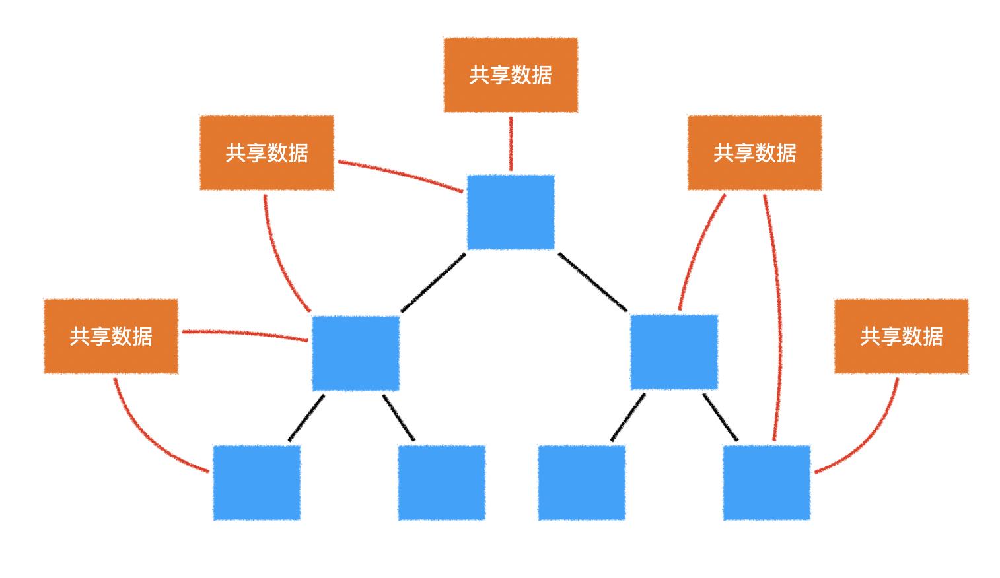
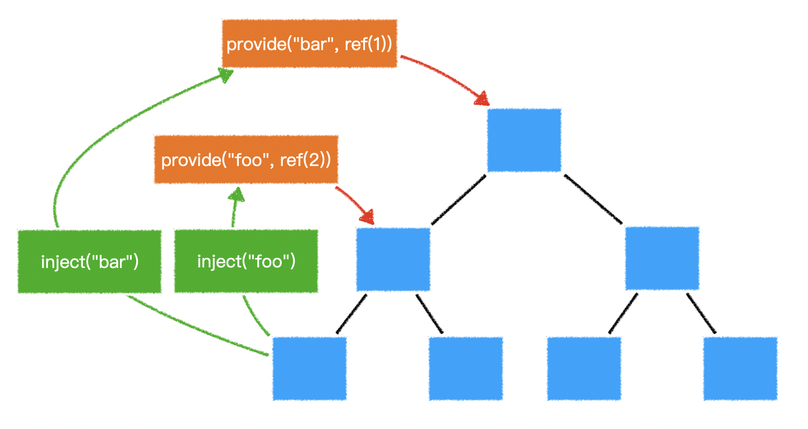

## vuex

创建`store`

```js
import { createStore } from 'vuex';
import userLogin from './userLogin';

export default createStore({
  modules: {
    // 模块
   	userLogin
  }
});

// userLogin 模块
import * as userServ from "../api/user";
export default {
    namespaced: true,
    state: {
        user: null,
        loading: false
    },
    mutations: {
        setUser(state, payload) {
            state.user = payload;
        },
        setLoading(state, payload) {
            state.loading = payload;
        }
    },
    actions: {
        async login(ctx, payload) {
            ctx.commit("setLoading", true);
            const user = await userServ.login(payload.loginId, payload.loginPwd);
            ctx.commit("setUser", user);
            ctx.commit("setLoading", false);
            return user;
        }
    }
}
```

使用`store`

```js
import { useStore } from 'vuex';

export default {
    setup(){
        const store = useStore();
        
        return {
            store
        }
    }
}
```


## vue-router

创建`router`

```js
import { createRouter, createWebHistory } from "vue-router";
import routes from "./routes";

// https://next.router.vuejs.org/guide/migration/
export default createRouter({
	history: createWebHistory(),
  	routes,
});
```

使用`router、route`

```js
import { useRouter, useRoute } from 'vue-router';

export default {
    setup(){
        const router = useRouter();
        const routes = useRoute();
        
        return {
            
        }
    }
}
```

## global state

> 由于`vue3`的响应式系统可以脱离组件而存在。因此可以充分利用这一点，轻松制造多个全局响应式数据。



```js
import { reactive, readonly } from 'vue'
import * as userServ from '@/api/userLogin'

// 创建默认的全局单例响应式数据，仅供该模块内部使用
const state = reactive({
    user: null,
    loading: false,
});

// 对外暴露的数据是只读的，不能直接修改
// 也可以进一步使用toRefs进行封装，从而避免解构或展开后响应式丢失
export const userLoginState = readonly(state);

// 登录
export async function login(loginId, loginPwd) {
    state.loading = true;
    const user = await userServ.login(loginId, loginPwd);
    state.loading = false;
    state.user = user;
}

// 退出
export async function loginOut() {
    state.loading = true;
    await userServ.loginOut();
    state.loading = false;
    state.user = null;
}

// 恢复登录状态
export async function whoAmI() {
    state.loading = true;
    const user = await userServ.whoAmI();
    state.loading = false;
    state.user = user;
}
```


## provide与inject

> 在`vue2`中，提供了`provide`和`inject`配置。可以让开发者在高层组件中注入数据，然后在后代组件中使用。


> 除了兼容`vue2`的配置式注入，`vue3`在`composition` API中添加了`provide`和`inject`方法，可以在`setup`函数中注入和使用数据。



考虑到有些数据需要在整个vue应用中使用，`vue3`还在应用实例中加入了`provide`方法，用于提供整个应用的共享数据。

```js
import { createApp, provide, ref } from 'vue';
import App from './App.vue';

createApp(App)
    .provide('foo', ref(1))
	.provide('bar', ref(2))
	.mount('#app');
```


```js
import { inject, reactive, readonly } from 'vue'
import * as userServ from '@/api/userLogin'

const KEY = Symbol.for('userLogin');

export const provideStore = (app) => {
    const state = reactive({
        user: null,
        loading: false,
    });

    // 登录
    async function login(loginId, loginPwd) {
        state.loading = true;
        const user = await userServ.login(loginId, loginPwd);
        state.loading = false;
        state.user = user;

        return user;
    }

    // 退出
    async function loginOut() {
        state.loading = true;
        await userServ.loginOut();
        state.loading = false;
        state.user = null;
    }

    // 恢复登录状态
    async function whoAmI() {
        state.loading = true;
        const user = await userServ.whoAmI();
        state.loading = false;
        state.user = user;
    }

    const provideData = {
        state: readonly(state),
        login,
        loginOut,
        whoAmI,
    };

    app?.provide(KEY, provideData);

    return provideData;
};

export function useStore(defaultValue = null) {
    return inject(KEY, defaultValue) ?? provideStore();
}


// store/index
// 应用所有store
import { provideStore as provideLoginUserStore } from "./useLoginUser";
// 继续导入其他共享数据模块...
// import { provideStore as provideNewsStore } from "./useNews"

// 提供统一的数据注入接口
export default function provideStore(app) {
  provideLoginUserStore(app);
  // 继续注入其他共享数据
  // provideNewsStore(app);
}

// main.js
import { createApp } from "vue";
import provideStore from "./store";
const app = createApp(App);
provideStore(app);
app.mount("#app");
```


## 对比

|              | vuex | global state | Provide&Inject |
| ------------ | ---- | ------------ | -------------- |
| 组件数据共享 | ✅    | ✅            | ✅              |
| 可否脱离组件 | ✅    | ✅            | ❌              |
| 调试工具     | ✅    | ❌            | ✅              |
| 状态树       | ✅    | 自行决定     | 自行决定       |
| 量级         | 重   | 轻           | 轻             |


